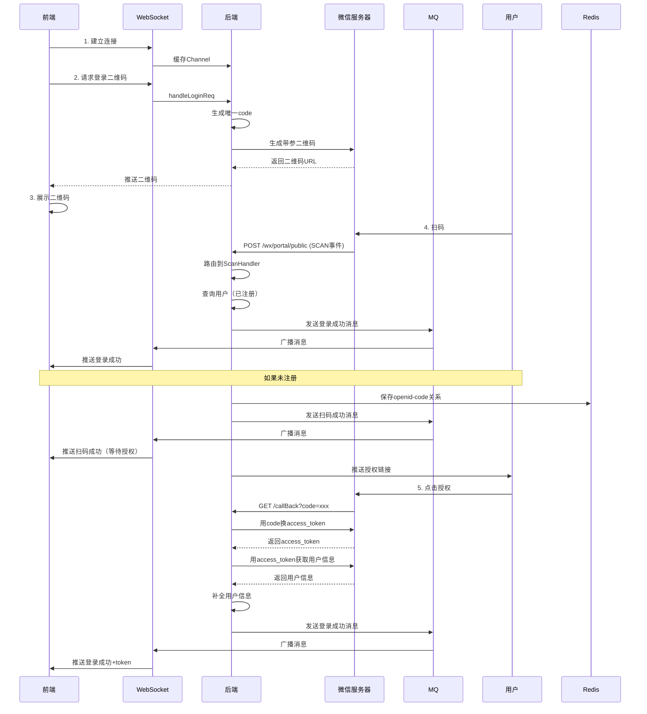

# MallChat微信交互技术方案详解

> **🎯 核心主题**：WxJava SDK集成 - 微信扫码登录与OAuth2授权  
> **📚 技术深度**：微信公众号API、OAuth2.0、事件回调、消息路由  
> **🔥 适用场景**：微信扫码登录、公众号集成、第三方授权  

---

## 📋 目录导航

- [一、STAR原则项目描述](#一star原则项目描述)
- [二、微信登录完整流程](#二微信登录完整流程)
- [三、WxJava SDK核心配置](#三wxjava-sdk核心配置)
- [四、核心接口详解](#四核心接口详解)
- [五、消息路由机制](#五消息路由机制)
- [六、OAuth2授权流程](#六oauth2授权流程)
- [七、关键技术点分析](#七关键技术点分析)
- [八、安全与优化](#八安全与优化)
- [九、面试高频问题](#九面试高频问题)
- [十、快速参考](#十快速参考)

---

## 一、STAR原则项目描述

### 🎯 **S - Situation（背景与挑战）**

**业务背景：**
在MallChat即时通讯系统中，需要实现：
- **扫码登录**：用户通过微信扫码快速登录
- **用户授权**：获取微信用户信息（昵称、头像）
- **事件通知**：实时接收微信服务器的扫码、关注等事件

**核心挑战：**

| 挑战 | 具体问题 | 影响 |
|-----|---------|------|
| **接口对接复杂** | 微信API众多，参数繁琐 | 开发效率低 |
| **安全验证** | 签名验证、消息加解密 | 安全风险高 |
| **异步回调** | 微信服务器异步推送事件 | 难以关联业务 |
| **多公众号支持** | 需要支持多个公众号配置 | 配置管理困难 |

---

### 🎯 **T - Target（设计目标）**

基于上述挑战，设计目标拆解为：

#### **目标1：简化微信API对接**
- 使用WxJava SDK封装微信API调用
- 统一配置管理
- 自动处理签名验证和消息加解密

#### **目标2：完整登录流程**
- 生成带参数二维码
- 接收扫码事件通知
- OAuth2授权获取用户信息
- 关联WebSocket连接推送登录结果

#### **目标3：消息路由机制**
- 根据消息类型自动路由到对应处理器
- 支持扫码、关注、默认消息等多种事件
- 异步处理提升性能

---

### 🚀 **A - Action（核心方案）**

## 二、微信登录完整流程

### 2.1 流程架构图

```
┌──────────────────────────────────────────────────────┐
│              微信扫码登录完整流程                       │
└──────────────────────────────────────────────────────┘

1. 前端建立WebSocket连接
   ↓
┌─────────────────────────────────────┐
│  WebSocket连接建立                   │
│  - 分配唯一Channel ID                │
│  - 缓存到本地Map                     │
└─────────────────────────────────────┘
   ↓
2. 前端请求登录二维码
   ↓
┌─────────────────────────────────────┐
│  生成登录码（code）                  │
│  - 生成唯一code（CAS乐观锁）         │
│  - code与Channel关联缓存             │
└─────────────────────────────────────┘
   ↓
┌─────────────────────────────────────┐
│  调用微信API生成带参二维码            │
│  wxMpService.getQrcodeService()     │
│    .qrCodeCreateTmpTicket(code)     │
│  - 参数：code（场景值）              │
│  - 返回：二维码URL                   │
└─────────────────────────────────────┘
   ↓
3. 用户扫码
   ↓
┌─────────────────────────────────────┐
│  微信服务器推送SCAN事件               │
│  → POST /wx/portal/public            │
│  - FromUser: openid                  │
│  - EventKey: code                    │
└─────────────────────────────────────┘
   ↓
┌─────────────────────────────────────┐
│  消息路由到ScanHandler               │
│  - 解析openid和code                  │
│  - 查询用户是否已注册                │
└─────────────────────────────────────┘
   ↓
   已注册？
    /    \
  YES     NO
   ↓       ↓
登录成功  注册用户
   ↓       ↓
   |    保存openid-code关系到Redis
   |       ↓
   |    推送扫码成功消息到前端
   |       ↓
   |    推送授权链接给用户微信
   |       ↓
4. 用户点击授权
   ↓
┌─────────────────────────────────────┐
│  微信OAuth2授权                      │
│  → 跳转授权页面                      │
│  → 用户同意授权                      │
│  → 微信回调/callBack?code=xxx        │
└─────────────────────────────────────┘
   ↓
┌─────────────────────────────────────┐
│  用code换取access_token              │
│  wxService.getOAuth2Service()       │
│    .getAccessToken(code)            │
└─────────────────────────────────────┘
   ↓
┌─────────────────────────────────────┐
│  获取用户详细信息                    │
│  wxService.getOAuth2Service()       │
│    .getUserInfo(accessToken)        │
│  - 昵称、头像、性别等                │
└─────────────────────────────────────┘
   ↓
┌─────────────────────────────────────┐
│  补全用户信息                        │
│  - 保存昵称、头像到DB                │
│  - 从Redis获取code                   │
└─────────────────────────────────────┘
   ↓
5. 登录成功
   ↓
┌─────────────────────────────────────┐
│  发送MQ登录成功消息                  │
│  → 广播到所有WebSocket节点           │
│  → 根据code找到对应Channel           │
│  → 推送登录成功消息                  │
│  → 生成JWT token                     │
└─────────────────────────────────────┘
   ↓
前端接收登录成功消息
```

---

### 2.2 时序图



---

## 三、WxJava SDK核心配置

### 3.1 Maven依赖

```xml
<dependency>
    <groupId>com.github.binarywang</groupId>
    <artifactId>weixin-java-mp</artifactId>
    <version>4.3.0</version>
</dependency>
```

---

### 3.2 配置文件

```yaml
# application.yml
wx:
  mp:
    # 微信公众号回调地址
    callback: http://your-domain.com
    # 多公众号配置
    configs:
      - appId: your_app_id           # 公众号AppID
        secret: your_app_secret      # 公众号AppSecret
        token: your_token             # 消息验证Token
        aesKey: your_aes_key          # 消息加密密钥（可选）
```

---

### 3.3 核心配置类

#### **配置属性类**

```java
@Data
@ConfigurationProperties(prefix = "wx.mp")
public class WxMpProperties {
    
    /**
     * 是否使用Redis存储access_token
     */
    private boolean useRedis;
    
    /**
     * Redis配置
     */
    private RedisConfig redisConfig;
    
    /**
     * 多个公众号配置
     */
    private List<MpConfig> configs;
    
    @Data
    public static class MpConfig {
        /**
         * 微信公众号AppID
         */
        private String appId;
        
        /**
         * 微信公众号AppSecret
         */
        private String secret;
        
        /**
         * 消息验证Token
         */
        private String token;
        
        /**
         * 消息加密密钥
         */
        private String aesKey;
    }
}
```

---

#### **WxMpService配置**

```java
@Configuration
@EnableConfigurationProperties(WxMpProperties.class)
@AllArgsConstructor
public class WxMpConfiguration {
    
    private final WxMpProperties properties;
    
    /**
     * WxMpService核心服务
     * 负责与微信API交互
     */
    @Bean
    public WxMpService wxMpService() {
        List<WxMpProperties.MpConfig> configs = this.properties.getConfigs();
        
        if (configs == null) {
            throw new RuntimeException("请配置微信公众号信息");
        }
        
        // 创建WxMpService实例
        WxMpService service = new WxMpServiceImpl();
        
        // 配置多公众号支持
        service.setMultiConfigStorages(
            configs.stream()
                .map(config -> {
                    WxMpDefaultConfigImpl configStorage = new WxMpDefaultConfigImpl();
                    configStorage.setAppId(config.getAppId());
                    configStorage.setSecret(config.getSecret());
                    configStorage.setToken(config.getToken());
                    configStorage.setAesKey(config.getAesKey());
                    return configStorage;
                })
                .collect(Collectors.toMap(
                    WxMpDefaultConfigImpl::getAppId, 
                    config -> config, 
                    (o, n) -> o
                ))
        );
        
        return service;
    }
}
```

**关键点：**
1. **多公众号支持**：通过`setMultiConfigStorages`配置多个公众号
2. **配置存储**：`WxMpDefaultConfigImpl`存储AppID、Secret等配置
3. **自动管理**：SDK自动管理access_token的获取和刷新

---

## 四、核心接口详解

### 4.1 微信认证接口

```java
@RestController
@RequestMapping("wx/portal/public")
public class WxPortalController {
    
    @Autowired
    private WxMpService wxService;
    
    /**
     * 微信服务器验证接口
     * 首次配置公众号时，微信服务器会发送GET请求验证
     */
    @GetMapping(produces = "text/plain;charset=utf-8")
    public String authGet(
        @RequestParam(name = "signature") String signature,
        @RequestParam(name = "timestamp") String timestamp,
        @RequestParam(name = "nonce") String nonce,
        @RequestParam(name = "echostr") String echostr
    ) {
        log.info("接收到来自微信服务器的认证消息：[{}, {}, {}, {}]", 
            signature, timestamp, nonce, echostr);
        
        // 验证签名
        if (wxService.checkSignature(timestamp, nonce, signature)) {
            // 签名正确，原样返回echostr
            return echostr;
        }
        
        return "非法请求";
    }
}
```

**验证流程：**
1. 微信服务器发送4个参数：signature、timestamp、nonce、echostr
2. 后端使用token、timestamp、nonce生成签名
3. 对比微信传来的signature，一致则返回echostr
4. 微信服务器验证echostr正确后，配置生效

---

### 4.2 生成带参二维码

```java
@Service
public class WebSocketServiceImpl {
    
    @Autowired
    private WxMpService wxMpService;
    
    private static final Duration EXPIRE_TIME = Duration.ofHours(1);
    
    /**
     * 处理登录请求
     */
    public void handleLoginReq(Channel channel) {
        // 1. 生成唯一登录码（CAS乐观锁保证唯一性）
        Integer code = generateLoginCode(channel);
        
        try {
            // 2. 调用微信API生成临时带参二维码
            WxMpQrCodeTicket ticket = wxMpService.getQrcodeService()
                .qrCodeCreateTmpTicket(code, (int) EXPIRE_TIME.getSeconds());
            
            // 3. 返回二维码URL给前端
            sendMsg(channel, WSAdapter.buildLoginResp(ticket));
            
        } catch (WxErrorException e) {
            log.error("生成二维码失败", e);
        }
    }
    
    /**
     * 生成不重复的登录码（CAS乐观锁）
     */
    private Integer generateLoginCode(Channel channel) {
        Integer code;
        do {
            code = RandomUtil.randomInt(Integer.MAX_VALUE);
        } while (WAIT_LOGIN_MAP.putIfAbsent(code, channel) != null);
        
        return code;
    }
}
```

**API调用链路：**

```java
wxMpService.getQrcodeService()
    .qrCodeCreateTmpTicket(sceneId, expireSeconds);

// SDK内部处理：
// 1. 获取access_token（自动管理，过期自动刷新）
// 2. 构建请求参数
POST https://api.weixin.qq.com/cgi-bin/qrcode/create?access_token=TOKEN
{
  "expire_seconds": 3600,
  "action_name": "QR_SCENE",
  "action_info": {
    "scene": {
      "scene_id": 123456  // 即我们的code
    }
  }
}
// 3. 返回二维码ticket和URL
{
  "ticket": "gQH47joAAAAAAAAAASxodHRwOi8vd2VpeGluLnFxLmNvbS9xLzAy...",
  "expire_seconds": 3600,
  "url": "http://weixin.qq.com/q/kZgfwMTm72WWPkovabbI"
}
```

**关键技术：**
1. **场景值（sceneId）**：我们的唯一登录码code
2. **临时二维码**：有效期1小时，扫码后微信会带上sceneId
3. **access_token**：SDK自动管理，无需手动获取

---

### 4.3 接收微信事件推送

```java
@RestController
@RequestMapping("wx/portal/public")
public class WxPortalController {
    
    @Autowired
    private WxMpService wxService;
    @Autowired
    private WxMpMessageRouter messageRouter;
    
    /**
     * 接收微信服务器推送的消息/事件
     */
    @PostMapping(produces = "application/xml; charset=UTF-8")
    public String post(
        @RequestBody String requestBody,
        @RequestParam("signature") String signature,
        @RequestParam("timestamp") String timestamp,
        @RequestParam("nonce") String nonce,
        @RequestParam("openid") String openid,
        @RequestParam(name = "encrypt_type", required = false) String encType,
        @RequestParam(name = "msg_signature", required = false) String msgSignature
    ) {
        log.info("接收微信请求：openid={}, signature={}, requestBody={}", 
            openid, signature, requestBody);
        
        // 1. 验证签名
        if (!wxService.checkSignature(timestamp, nonce, signature)) {
            throw new IllegalArgumentException("非法请求，可能属于伪造的请求！");
        }
        
        String out = null;
        
        // 2. 解析消息（明文/密文）
        if (encType == null) {
            // 明文传输
            WxMpXmlMessage inMessage = WxMpXmlMessage.fromXml(requestBody);
            WxMpXmlOutMessage outMessage = this.route(inMessage);
            out = outMessage != null ? outMessage.toXml() : "";
            
        } else if ("aes".equalsIgnoreCase(encType)) {
            // AES加密传输
            WxMpXmlMessage inMessage = WxMpXmlMessage.fromEncryptedXml(
                requestBody, 
                wxService.getWxMpConfigStorage(),
                timestamp, 
                nonce, 
                msgSignature
            );
            WxMpXmlOutMessage outMessage = this.route(inMessage);
            out = outMessage != null 
                ? outMessage.toEncryptedXml(wxService.getWxMpConfigStorage()) 
                : "";
        }
        
        return out;
    }
    
    /**
     * 路由消息到对应处理器
     */
    private WxMpXmlOutMessage route(WxMpXmlMessage message) {
        try {
            return this.messageRouter.route(message);
        } catch (Exception e) {
            log.error("路由消息时出现异常", e);
            return null;
        }
    }
}
```

**微信推送的XML格式：**

```xml
<!-- 扫码事件 -->
<xml>
  <ToUserName><![CDATA[公众号原始ID]]></ToUserName>
  <FromUser><![CDATA[用户openid]]></FromUser>
  <CreateTime>1234567890</CreateTime>
  <MsgType><![CDATA[event]]></MsgType>
  <Event><![CDATA[SCAN]]></Event>
  <EventKey><![CDATA[123456]]></EventKey>  <!-- 我们的code -->
  <Ticket><![CDATA[TICKET]]></Ticket>
</xml>
```

---

## 五、消息路由机制

### 5.1 消息路由配置

```java
@Configuration
public class WxMpConfiguration {
    
    @Autowired
    private LogHandler logHandler;
    @Autowired
    private SubscribeHandler subscribeHandler;
    @Autowired
    private ScanHandler scanHandler;
    @Autowired
    private MsgHandler msgHandler;
    
    /**
     * 配置消息路由规则
     */
    @Bean
    public WxMpMessageRouter messageRouter(WxMpService wxMpService) {
        WxMpMessageRouter router = new WxMpMessageRouter(wxMpService);
        
        // 1. 记录所有事件的日志（异步执行）
        router.rule()
            .handler(this.logHandler)
            .next();  // next()表示继续匹配后续规则
        
        // 2. 关注事件：msgType=event, event=subscribe
        router.rule()
            .async(false)  // 同步执行
            .msgType(WxConsts.XmlMsgType.EVENT)
            .event(WxConsts.EventType.SUBSCRIBE)
            .handler(this.subscribeHandler)
            .end();  // end()表示匹配后不再继续
        
        // 3. 扫码事件：msgType=event, event=SCAN
        router.rule()
            .async(false)
            .msgType(WxConsts.XmlMsgType.EVENT)
            .event(WxConsts.EventType.SCAN)
            .handler(this.scanHandler)
            .end();
        
        // 4. 默认处理器（兜底）
        router.rule()
            .async(false)
            .handler(this.msgHandler)
            .end();
        
        return router;
    }
}
```

**路由规则说明：**

| 规则 | 条件 | 处理器 | 说明 |
|-----|------|--------|------|
| 日志记录 | 所有消息 | LogHandler | 异步记录，不阻塞 |
| 关注事件 | event=SUBSCRIBE | SubscribeHandler | 用户关注公众号 |
| 扫码事件 | event=SCAN | ScanHandler | ✅ 核心：处理登录扫码 |
| 默认处理 | 其他消息 | MsgHandler | 兜底处理器 |

---

### 5.2 扫码事件处理器

```java
@Component
@RequiredArgsConstructor
public class ScanHandler implements WxMpMessageHandler {
    
    private final WxMsgService wxMsgService;
    
    @Override
    public WxMpXmlOutMessage handle(
        WxMpXmlMessage wxMessage,
        Map<String, Object> context,
        WxMpService wxMpService,
        WxSessionManager sessionManager
    ) {
        // 委托给业务服务处理
        return wxMsgService.scan(wxMpService, wxMessage);
    }
}
```

---

### 5.3 扫码业务逻辑

```java
@Service
public class WxMsgService {
    
    @Autowired
    private UserDao userDao;
    @Autowired
    private MQProducer mqProducer;
    
    private static final String AUTH_URL = 
        "https://open.weixin.qq.com/connect/oauth2/authorize" +
        "?appid=%s&redirect_uri=%s&response_type=code" +
        "&scope=snsapi_userinfo&state=STATE#wechat_redirect";
    
    @Value("${wx.mp.callback}")
    private String callback;
    
    /**
     * 处理扫码事件
     */
    public WxMpXmlOutMessage scan(WxMpService wxMpService, WxMpXmlMessage wxMessage) {
        // 1. 解析openid和登录码
        String openid = wxMessage.getFromUser();
        Integer loginCode = Integer.parseInt(getEventKey(wxMessage));
        
        // 2. 查询用户是否已注册
        User user = userDao.getByOpenId(openid);
        
        // 3. 已注册且有头像 → 直接登录
        if (user != null && StringUtils.isNotEmpty(user.getAvatar())) {
            // 发送MQ登录成功消息
            mqProducer.sendMsg(
                MQConstant.LOGIN_MSG_TOPIC,
                new LoginMessageDTO(user.getId(), loginCode)
            );
            return null;  // 无需回复消息
        }
        
        // 4. 未注册 → 先注册
        if (user == null) {
            user = User.builder().openId(openid).build();
            userService.register(user);
        }
        
        // 5. 保存openid-loginCode关系到Redis（60分钟过期）
        RedisUtils.set(
            RedisKey.getKey(RedisKey.OPEN_ID_STRING, openid),
            loginCode,
            60,
            TimeUnit.MINUTES
        );
        
        // 6. 发送MQ扫码成功消息（通知前端显示"等待授权"）
        mqProducer.sendMsg(
            MQConstant.SCAN_MSG_TOPIC,
            new ScanSuccessMessageDTO(loginCode)
        );
        
        // 7. 生成授权链接
        String authUrl = String.format(
            AUTH_URL,
            wxMpService.getWxMpConfigStorage().getAppId(),
            URLEncoder.encode(callback + "/wx/portal/public/callBack")
        );
        
        // 8. 给用户微信推送授权链接
        return new TextBuilder().build(
            "请点击链接授权：<a href=\"" + authUrl + "\">登录</a>",
            wxMessage,
            wxMpService
        );
    }
    
    /**
     * 获取EventKey（去除qrscene_前缀）
     */
    private String getEventKey(WxMpXmlMessage wxMessage) {
        // 扫码关注的事件Key有前缀，需要去除
        return wxMessage.getEventKey().replace("qrscene_", "");
    }
}
```

**关键步骤：**
1. ✅ 解析openid（用户唯一标识）和loginCode（登录码）
2. ✅ 判断是否已注册：已注册直接登录，未注册先注册
3. ✅ 保存openid-loginCode映射到Redis
4. ✅ MQ通知前端"扫码成功，等待授权"
5. ✅ 给用户微信推送OAuth2授权链接

---

## 六、OAuth2授权流程

### 6.1 授权链接构建

```java
// 授权URL模板
private static final String AUTH_URL = 
    "https://open.weixin.qq.com/connect/oauth2/authorize" +
    "?appid=%s" +                    // 公众号AppID
    "&redirect_uri=%s" +              // 授权回调地址
    "&response_type=code" +           // 固定值：code
    "&scope=snsapi_userinfo" +        // 授权作用域：获取用户信息
    "&state=STATE" +                  // 自定义参数（可选）
    "#wechat_redirect";               // 微信内置浏览器标识

// 实际生成的授权链接
String authUrl = String.format(
    AUTH_URL,
    "wx1234567890abcdef",  // AppID
    URLEncoder.encode("http://your-domain.com/wx/portal/public/callBack")
);

// 最终链接示例：
// https://open.weixin.qq.com/connect/oauth2/authorize
//   ?appid=wx1234567890abcdef
//   &redirect_uri=http%3A%2F%2Fyour-domain.com%2Fwx%2Fportal%2Fpublic%2FcallBack
//   &response_type=code
//   &scope=snsapi_userinfo
//   &state=STATE
//   #wechat_redirect
```

**scope说明：**
- `snsapi_base`：静默授权，只能获取openid
- `snsapi_userinfo`：弹窗授权，可获取昵称、头像等（✅ 我们使用这个）

---

### 6.2 授权回调处理

```java
@RestController
@RequestMapping("wx/portal/public")
public class WxPortalController {
    
    @Autowired
    private WxMpService wxService;
    @Autowired
    private WxMsgService wxMsgService;
    
    /**
     * OAuth2授权回调
     * 用户同意授权后，微信会重定向到这个地址，并带上code参数
     */
    @GetMapping("/callBack")
    public RedirectView callBack(@RequestParam String code) {
        try {
            // 1. 用code换取access_token
            WxOAuth2AccessToken accessToken = wxService
                .getOAuth2Service()
                .getAccessToken(code);
            
            // 2. 用access_token获取用户详细信息
            WxOAuth2UserInfo userInfo = wxService
                .getOAuth2Service()
                .getUserInfo(accessToken, "zh_CN");
            
            // 3. 授权成功，保存用户信息
            wxMsgService.authorize(userInfo);
            
        } catch (Exception e) {
            log.error("授权回调失败", e);
        }
        
        // 4. 重定向到前端页面
        RedirectView redirectView = new RedirectView();
        redirectView.setUrl("http://localhost:9988");
        return redirectView;
    }
}
```

**API调用链路：**

```java
// 1. 用code换取access_token
POST https://api.weixin.qq.com/sns/oauth2/access_token
  ?appid=APPID
  &secret=SECRET
  &code=CODE
  &grant_type=authorization_code

// 返回：
{
  "access_token": "ACCESS_TOKEN",
  "expires_in": 7200,
  "refresh_token": "REFRESH_TOKEN",
  "openid": "OPENID",
  "scope": "snsapi_userinfo"
}

// 2. 用access_token获取用户信息
GET https://api.weixin.qq.com/sns/userinfo
  ?access_token=ACCESS_TOKEN
  &openid=OPENID
  &lang=zh_CN

// 返回：
{
  "openid": "OPENID",
  "nickname": "用户昵称",
  "sex": 1,
  "province": "广东",
  "city": "深圳",
  "country": "中国",
  "headimgurl": "http://wx.qlogo.cn/...",
  "privilege": []
}
```

---

### 6.3 用户信息授权处理

```java
@Service
public class WxMsgService {
    
    @Autowired
    private UserDao userDao;
    @Autowired
    private MQProducer mqProducer;
    
    /**
     * 授权成功，保存用户信息
     */
    public void authorize(WxOAuth2UserInfo userInfo) {
        // 1. 根据openid查询用户
        User user = userDao.getByOpenId(userInfo.getOpenid());
        
        // 2. 补全用户信息（昵称、头像等）
        if (StringUtils.isEmpty(user.getName())) {
            fillUserInfo(user.getId(), userInfo);
        }
        
        // 3. 从Redis获取之前保存的loginCode
        Integer code = RedisUtils.get(
            RedisKey.getKey(RedisKey.OPEN_ID_STRING, userInfo.getOpenid()),
            Integer.class
        );
        
        // 4. 发送MQ登录成功消息
        mqProducer.sendMsg(
            MQConstant.LOGIN_MSG_TOPIC,
            new LoginMessageDTO(user.getId(), code)
        );
    }
    
    /**
     * 填充用户信息（处理昵称重复）
     */
    private void fillUserInfo(Long uid, WxOAuth2UserInfo userInfo) {
        User update = UserAdapter.buildAuthorizeUser(uid, userInfo);
        
        // 重试5次处理昵称重复
        for (int i = 0; i < 5; i++) {
            try {
                userDao.updateById(update);
                return;
            } catch (DuplicateKeyException e) {
                // 昵称重复，添加随机后缀
                log.info("昵称重复 uid:{}, info:{}", uid, userInfo);
                update.setName("名字重置" + RandomUtil.randomInt(100000));
            } catch (Exception e) {
                log.error("填充用户信息失败 uid:{}, info:{}", uid, userInfo, e);
            }
        }
    }
}
```

---

## 七、关键技术点分析

### 7.1 access_token自动管理

**WxJava SDK自动处理：**

```java
// SDK内部逻辑
public class WxMpServiceImpl implements WxMpService {
    
    private String getAccessToken(boolean forceRefresh) {
        WxMpConfigStorage config = getWxMpConfigStorage();
        
        if (!config.isAccessTokenExpired() && !forceRefresh) {
            // access_token未过期，直接返回
            return config.getAccessToken();
        }
        
        // access_token过期或强制刷新
        // 调用微信API获取新token
        String url = "https://api.weixin.qq.com/cgi-bin/token" +
                     "?grant_type=client_credential" +
                     "&appid=" + config.getAppId() +
                     "&secret=" + config.getSecret();
        
        WxAccessToken accessToken = get(url, WxAccessToken.class);
        
        // 保存到配置存储
        config.updateAccessToken(
            accessToken.getAccessToken(),
            accessToken.getExpiresIn()
        );
        
        return accessToken.getAccessToken();
    }
}
```

**关键点：**
1. ✅ SDK自动检测token是否过期
2. ✅ 过期自动刷新，无需手动管理
3. ✅ 支持Redis存储，集群环境共享token

---

### 7.2 签名验证机制

```java
/**
 * 微信签名验证算法
 */
public boolean checkSignature(String timestamp, String nonce, String signature) {
    // 1. 将token、timestamp、nonce三个参数字典序排序
    String[] arr = new String[]{token, timestamp, nonce};
    Arrays.sort(arr);
    
    // 2. 拼接成字符串
    StringBuilder sb = new StringBuilder();
    for (String s : arr) {
        sb.append(s);
    }
    
    // 3. SHA1加密
    String tmpStr = DigestUtils.sha1Hex(sb.toString());
    
    // 4. 对比微信传来的signature
    return tmpStr.equalsIgnoreCase(signature);
}
```

**验证流程：**
```
1. 服务端配置：token = "mytoken123"
   ↓
2. 微信发送：timestamp=1234567890, nonce=abc123, signature=xxxxx
   ↓
3. 后端计算：
   - 排序：["mytoken123", "1234567890", "abc123"] → ["1234567890", "abc123", "mytoken123"]
   - 拼接："1234567890abc123mytoken123"
   - SHA1："xxxxx"
   ↓
4. 对比：计算的SHA1 == 微信的signature ？
```

---

### 7.3 消息加解密

**AES加密模式：**

```java
// 微信推送加密消息
WxMpXmlMessage inMessage = WxMpXmlMessage.fromEncryptedXml(
    requestBody,
    wxService.getWxMpConfigStorage(),
    timestamp,
    nonce,
    msgSignature
);

// SDK内部解密流程：
// 1. 验证msg_signature
// 2. Base64解码
// 3. AES-CBC解密（使用EncodingAESKey）
// 4. 去除16位随机字符串
// 5. 解析XML

// 回复加密消息
String out = outMessage.toEncryptedXml(wxService.getWxMpConfigStorage());

// SDK内部加密流程：
// 1. 生成16位随机字符串
// 2. 拼接消息
// 3. AES-CBC加密
// 4. Base64编码
// 5. 计算msg_signature
```

---

### 7.4 登录码防重机制

```java
/**
 * CAS乐观锁生成唯一登录码
 */
private static final ConcurrentHashMap<Integer, Channel> WAIT_LOGIN_MAP = 
    new ConcurrentHashMap<>();

private Integer generateLoginCode(Channel channel) {
    Integer code;
    do {
        // 生成随机code
        code = RandomUtil.randomInt(Integer.MAX_VALUE);
        
        // CAS操作：如果code不存在，则插入
    } while (WAIT_LOGIN_MAP.putIfAbsent(code, channel) != null);
    
    return code;
}
```

**原理：**
- `putIfAbsent(key, value)`：如果key不存在，插入并返回null；如果key存在，返回旧值
- `do-while`循环：直到找到一个不存在的code
- 并发安全：`ConcurrentHashMap`保证线程安全

---

### 7.5 降级方案

```java
/**
 * MQ不可用时的降级方案
 */
public WxMpXmlOutMessage scan(WxMpService wxMpService, WxMpXmlMessage wxMessage) {
    try {
        // 优先使用MQ（解耦、异步）
        mqProducer.sendMsg(MQConstant.LOGIN_MSG_TOPIC, loginMessageDTO);
    } catch (Exception e) {
        // MQ不可用，降级为直接推送
        log.warn("MQ不可用，使用降级方案直接推送登录成功消息: {}", e.getMessage());
        webSocketService.scanLoginSuccess(loginCode, userId);
    }
}
```

**降级策略：**
1. **正常流程**：MQ广播 → 所有WebSocket节点 → 找到对应Channel → 推送
2. **降级流程**：直接调用WebSocket服务推送（仅本地节点）
3. **权衡**：降级方案可能丢失跨节点推送能力，但保证核心功能可用

---

## 八、WxJava SDK底层原理深度剖析

### 8.1 WxJava SDK核心架构

#### **8.1.1 整体架构图**

```
┌─────────────────────────────────────────────────────────┐
│                   WxJava SDK 核心架构                      │
└─────────────────────────────────────────────────────────┘

                    ┌──────────────┐
                    │ 业务代码层    │
                    │ (MallChat)   │
                    └──────┬───────┘
                           │ 调用
                           ↓
        ┌──────────────────────────────────────┐
        │        WxMpService 核心服务接口        │
        ├──────────────────────────────────────┤
        │ - getQrcodeService()    二维码服务    │
        │ - getOAuth2Service()    授权服务      │
        │ - getUserService()      用户管理      │
        │ - getMenuService()      菜单管理      │
        │ - getMaterialService()  素材管理      │
        └──────────────┬───────────────────────┘
                       │ 实现
                       ↓
        ┌──────────────────────────────────────┐
        │      WxMpServiceImpl 核心实现类        │
        ├──────────────────────────────────────┤
        │ ✅ access_token自动管理               │
        │ ✅ 签名验证                           │
        │ ✅ 消息加解密                         │
        │ ✅ 多公众号配置                       │
        └──────────────┬───────────────────────┘
                       │
        ┌──────────────┴─────────────┬─────────────────┐
        │                            │                 │
        ↓                            ↓                 ↓
┌─────────────┐          ┌─────────────────┐  ┌──────────────┐
│ 配置存储层   │          │  HTTP请求执行层  │  │ 消息路由层    │
├─────────────┤          ├─────────────────┤  ├──────────────┤
│ DefaultImpl │          │ RequestExecutor │  │ MessageRouter│
│ RedisImpl   │          │ - GET           │  │ - 规则匹配    │
│ 自定义Impl  │          │ - POST          │  │ - Handler    │
└─────────────┘          │ - 文件上传       │  └──────────────┘
                         └────────┬────────┘
                                  │
                    ┌─────────────┴─────────────┐
                    │                           │
                    ↓                           ↓
            ┌──────────────┐          ┌──────────────┐
            │  OkHttp      │          │ HttpClient   │
            │  (优先)      │          │  (备选)      │
            └──────┬───────┘          └──────┬───────┘
                   │                         │
                   └──────────┬──────────────┘
                              │ HTTP请求
                              ↓
                    ┌──────────────────┐
                    │   微信服务器      │
                    │  api.weixin.qq   │
                    └──────────────────┘
```

---

#### **8.1.2 核心接口层次**

```java
/**
 * 核心服务接口
 */
public interface WxMpService {
    
    // 二维码服务
    WxMpQrcodeService getQrcodeService();
    
    // OAuth2授权服务
    WxMpOAuth2Service getOAuth2Service();
    
    // 用户管理服务
    WxMpUserService getUserService();
    
    // 配置存储
    WxMpConfigStorage getWxMpConfigStorage();
    void setWxMpConfigStorage(WxMpConfigStorage configStorage);
    
    // access_token管理
    String getAccessToken(boolean forceRefresh);
    
    // 签名验证
    boolean checkSignature(String timestamp, String nonce, String signature);
}

/**
 * 核心实现类（简化版）
 */
public class WxMpServiceImpl implements WxMpService {
    
    private WxMpConfigStorage configStorage;
    private Map<String, WxMpConfigStorage> configStorageMap;  // 多公众号
    
    // 各种服务实例
    private WxMpQrcodeService qrcodeService = new WxMpQrcodeServiceImpl(this);
    private WxMpOAuth2Service oAuth2Service = new WxMpOAuth2ServiceImpl(this);
    private WxMpUserService userService = new WxMpUserServiceImpl(this);
    
    @Override
    public WxMpQrcodeService getQrcodeService() {
        return this.qrcodeService;
    }
    
    @Override
    public String getAccessToken(boolean forceRefresh) throws WxErrorException {
        // access_token获取逻辑（详见8.2节）
        return configStorage.getAccessToken();
    }
}
```

---

### 8.2 HTTP请求框架选择与封装

#### **8.2.1 支持的HTTP框架**

WxJava SDK支持多种HTTP客户端，按优先级自动选择：

```java
/**
 * HTTP框架优先级（SDK自动检测）
 */
// 1️⃣ OkHttp（推荐，性能最佳）
<dependency>
    <groupId>com.squareup.okhttp3</groupId>
    <artifactId>okhttp</artifactId>
    <version>4.9.3</version>
</dependency>

// 2️⃣ Apache HttpClient（功能最全）
<dependency>
    <groupId>org.apache.httpcomponents</groupId>
    <artifactId>httpclient</artifactId>
    <version>4.5.13</version>
</dependency>

// 3️⃣ Jodd Http（轻量级）
<dependency>
    <groupId>org.jodd</groupId>
    <artifactId>jodd-http</artifactId>
    <version>6.0.3</version>
</dependency>
```

---

#### **8.2.2 RequestExecutor请求执行器**

```java
/**
 * 请求执行器抽象类
 */
public abstract class RequestExecutor<T, E> {
    
    protected WxMpService wxMpService;
    
    /**
     * 执行HTTP请求
     * @param uri 请求地址
     * @param data 请求数据
     * @return 响应结果
     */
    public abstract T execute(String uri, E data) throws WxErrorException;
    
    /**
     * 处理响应
     */
    protected T handleResponse(String responseContent) {
        // 检查微信错误码
        if (responseContent.contains("errcode")) {
            WxError error = WxError.fromJson(responseContent);
            if (error.getErrorCode() != 0) {
                throw new WxErrorException(error);
            }
        }
        return parseResponse(responseContent);
    }
}

/**
 * GET请求执行器（OkHttp实现）
 */
public class SimpleGetRequestExecutor extends RequestExecutor<String, String> {
    
    @Override
    public String execute(String uri, String queryParam) throws WxErrorException {
        // 1. 构建完整URL
        String url = uri + (queryParam != null ? "?" + queryParam : "");
        
        // 2. 创建OkHttp请求
        OkHttpClient client = new OkHttpClient();
        Request request = new Request.Builder()
            .url(url)
            .get()
            .build();
        
        // 3. 执行请求
        try (Response response = client.newCall(request).execute()) {
            String responseContent = response.body().string();
            
            // 4. 处理响应
            return handleResponse(responseContent);
        } catch (IOException e) {
            throw new WxErrorException("HTTP请求失败", e);
        }
    }
}

/**
 * POST请求执行器（JSON）
 */
public class JsonPostRequestExecutor extends RequestExecutor<String, String> {
    
    @Override
    public String execute(String uri, String postData) throws WxErrorException {
        OkHttpClient client = new OkHttpClient();
        
        // 构建JSON请求体
        RequestBody body = RequestBody.create(
            postData, 
            MediaType.parse("application/json; charset=utf-8")
        );
        
        Request request = new Request.Builder()
            .url(uri)
            .post(body)
            .build();
        
        try (Response response = client.newCall(request).execute()) {
            return handleResponse(response.body().string());
        } catch (IOException e) {
            throw new WxErrorException("POST请求失败", e);
        }
    }
}
```

**参考文档：** [WxJava HTTP框架选择](https://github.com/binarywang/WxJava/wiki/http%E6%A1%86%E6%9E%B6%E7%9A%84%E9%80%89%E7%94%A8%E8%AF%B4%E6%98%8E)

---

### 8.3 access_token管理机制深度解析

#### **8.3.1 WxMpConfigStorage接口设计**

```java
/**
 * 配置存储接口（核心）
 */
public interface WxMpConfigStorage {
    
    // ========== 基础配置 ==========
    String getAppId();
    String getSecret();
    String getToken();
    String getAesKey();
    
    // ========== access_token管理 ==========
    String getAccessToken();
    boolean isAccessTokenExpired();
    void updateAccessToken(String accessToken, int expiresInSeconds);
    void expireAccessToken();
    Lock getAccessTokenLock();  // 并发控制锁
    
    // ========== jsapi_ticket管理 ==========
    String getJsapiTicket();
    boolean isJsapiTicketExpired();
    void updateJsapiTicket(String jsapiTicket, int expiresInSeconds);
    
    // ========== 卡券ticket管理 ==========
    String getCardApiTicket();
    boolean isCardApiTicketExpired();
    void updateCardApiTicket(String cardApiTicket, int expiresInSeconds);
}
```

---

#### **8.3.2 内存存储实现**

```java
/**
 * 默认内存存储实现（单机环境）
 */
public class WxMpDefaultConfigImpl implements WxMpConfigStorage {
    
    // 基础配置
    private String appId;
    private String secret;
    private String token;
    private String aesKey;
    
    // access_token及过期时间
    private volatile String accessToken;
    private volatile long accessTokenExpiresTime;
    
    // 并发锁
    private final Lock accessTokenLock = new ReentrantLock();
    
    @Override
    public String getAccessToken() {
        return this.accessToken;
    }
    
    @Override
    public boolean isAccessTokenExpired() {
        // 提前5分钟判定为过期（安全边界）
        return System.currentTimeMillis() > (this.accessTokenExpiresTime - 300000);
    }
    
    @Override
    public void updateAccessToken(String accessToken, int expiresInSeconds) {
        this.accessToken = accessToken;
        // 计算过期时间戳
        this.accessTokenExpiresTime = System.currentTimeMillis() 
            + (expiresInSeconds - 200) * 1000L;  // 提前200秒过期
    }
    
    @Override
    public Lock getAccessTokenLock() {
        return this.accessTokenLock;
    }
}
```

**关键设计：**
- ✅ `volatile`保证可见性
- ✅ 提前5分钟判定过期（安全边界）
- ✅ `ReentrantLock`防止并发刷新
- ✅ 过期时间减200秒（微信返回7200秒，实际按7000秒计算）

---

#### **8.3.3 Redis存储实现（集群环境）**

```java
/**
 * Redis存储实现（支持集群）
 */
public class WxMpRedisConfigImpl implements WxMpConfigStorage {
    
    private final RedisTemplate<String, String> redisTemplate;
    private final String keyPrefix;
    
    // 分布式锁
    private final Lock accessTokenLock;
    
    public WxMpRedisConfigImpl(RedisTemplate<String, String> redisTemplate, 
                                String keyPrefix) {
        this.redisTemplate = redisTemplate;
        this.keyPrefix = keyPrefix;
        // 使用Redisson分布式锁
        this.accessTokenLock = new RedissonLock(redisTemplate, keyPrefix + "lock");
    }
    
    @Override
    public String getAccessToken() {
        return redisTemplate.opsForValue().get(keyPrefix + "access_token");
    }
    
    @Override
    public boolean isAccessTokenExpired() {
        Long expireTime = redisTemplate.opsForValue()
            .get(keyPrefix + "access_token_expires_time", Long.class);
        
        if (expireTime == null) {
            return true;
        }
        
        // 提前5分钟判定为过期
        return System.currentTimeMillis() > (expireTime - 300000);
    }
    
    @Override
    public void updateAccessToken(String accessToken, int expiresInSeconds) {
        String tokenKey = keyPrefix + "access_token";
        String timeKey = keyPrefix + "access_token_expires_time";
        
        // 保存token
        redisTemplate.opsForValue().set(
            tokenKey, 
            accessToken, 
            expiresInSeconds, 
            TimeUnit.SECONDS
        );
        
        // 保存过期时间戳
        long expiresTime = System.currentTimeMillis() 
            + (expiresInSeconds - 200) * 1000L;
        redisTemplate.opsForValue().set(
            timeKey, 
            String.valueOf(expiresTime),
            expiresInSeconds,
            TimeUnit.SECONDS
        );
    }
    
    @Override
    public Lock getAccessTokenLock() {
        return this.accessTokenLock;
    }
}
```

**集群优势：**
- ✅ 多节点共享access_token，避免重复获取
- ✅ 分布式锁保证集群环境下的并发安全
- ✅ Redis持久化，重启不丢失

---

#### **8.3.4 access_token自动刷新流程**

```java
/**
 * WxMpServiceImpl核心实现
 */
public class WxMpServiceImpl implements WxMpService {
    
    private WxMpConfigStorage configStorage;
    
    /**
     * 获取access_token（带自动刷新）
     */
    @Override
    public String getAccessToken(boolean forceRefresh) throws WxErrorException {
        
        // 1️⃣ 不强制刷新 + 未过期 → 直接返回
        if (!forceRefresh && !configStorage.isAccessTokenExpired()) {
            return configStorage.getAccessToken();
        }
        
        // 2️⃣ 获取锁（防止并发刷新）
        Lock lock = configStorage.getAccessTokenLock();
        lock.lock();
        
        try {
            // 3️⃣ 双重检查（其他线程可能已刷新）
            if (!forceRefresh && !configStorage.isAccessTokenExpired()) {
                return configStorage.getAccessToken();
            }
            
            // 4️⃣ 调用微信API获取新token
            String url = String.format(
                WxMpApiUrl.GET_ACCESS_TOKEN_URL,  
                // https://api.weixin.qq.com/cgi-bin/token
                configStorage.getAppId(),
                configStorage.getSecret()
            );
            
            String responseContent = execute(
                new SimpleGetRequestExecutor(), 
                url, 
                null
            );
            
            // 5️⃣ 解析响应
            WxAccessToken wxAccessToken = WxAccessToken.fromJson(responseContent);
            
            // 6️⃣ 更新配置存储
            configStorage.updateAccessToken(
                wxAccessToken.getAccessToken(),
                wxAccessToken.getExpiresIn()
            );
            
            return wxAccessToken.getAccessToken();
            
        } finally {
            lock.unlock();
        }
    }
    
    /**
     * 每次调用API前都会自动检查
     */
    private <T, E> T execute(RequestExecutor<T, E> executor, 
                              String uri, 
                              E data) throws WxErrorException {
        
        // 🔑 关键：自动拼接access_token
        String accessToken = getAccessToken(false);
        String uriWithToken = uri + (uri.contains("?") ? "&" : "?") 
            + "access_token=" + accessToken;
        
        try {
            return executor.execute(uriWithToken, data);
            
        } catch (WxErrorException e) {
            // access_token失效，强制刷新重试
            if (e.getError().getErrorCode() == 40001 
                || e.getError().getErrorCode() == 42001) {
                
                configStorage.expireAccessToken();  // 标记过期
                accessToken = getAccessToken(true);  // 强制刷新
                uriWithToken = uri + (uri.contains("?") ? "&" : "?") 
                    + "access_token=" + accessToken;
                
                return executor.execute(uriWithToken, data);
            }
            throw e;
        }
    }
}
```

**自动刷新流程图：**

```
业务调用API
    ↓
检查access_token是否过期
    ↓
    未过期 → 直接使用
    ↓
    已过期 → 加锁
         ↓
      双重检查
         ↓
      调用微信API
         ↓
      GET /cgi-bin/token
         ↓
      {
        "access_token": "...",
        "expires_in": 7200
      }
         ↓
      更新配置存储
         ↓
      返回新token
```

**参考文档：** 
- [access_token刷新机制](https://github.com/binarywang/WxJava/wiki/MP_%E5%88%B7%E6%96%B0access_token)
- [WxMpConfigStorage配置](https://github.com/binarywang/WxJava/wiki/MP_WxMpConfigStorage)

---

### 8.4 API调用完整链路剖析

#### **8.4.1 生成带参二维码 - 完整调用链**

```java
/**
 * ============ 第1层：业务代码调用 ============
 */
// MallChat项目中的调用
WxMpQrCodeTicket ticket = wxMpService
    .getQrcodeService()
    .qrCodeCreateTmpTicket(loginCode, 3600);

// ↓ ↓ ↓ 进入SDK内部 ↓ ↓ ↓

/**
 * ============ 第2层：WxMpQrcodeServiceImpl ============
 */
public class WxMpQrcodeServiceImpl implements WxMpQrcodeService {
    
    private final WxMpService wxMpService;
    
    @Override
    public WxMpQrCodeTicket qrCodeCreateTmpTicket(int sceneId, Integer expireSeconds) 
        throws WxErrorException {
        
        // 1. 构建请求参数
        WxMpQrCodeCreateRequestMessage requestMessage = new WxMpQrCodeCreateRequestMessage();
        requestMessage.setActionName("QR_SCENE");
        requestMessage.setExpireSeconds(expireSeconds);
        
        WxMpQrCodeCreateRequestMessage.ActionInfo actionInfo = 
            new WxMpQrCodeCreateRequestMessage.ActionInfo();
        WxMpQrCodeCreateRequestMessage.Scene scene = 
            new WxMpQrCodeCreateRequestMessage.Scene();
        scene.setSceneId(sceneId);  // ✅ 我们的登录码
        actionInfo.setScene(scene);
        requestMessage.setActionInfo(actionInfo);
        
        // 2. 转为JSON
        String requestJson = requestMessage.toJson();
        /*
        {
          "expire_seconds": 3600,
          "action_name": "QR_SCENE",
          "action_info": {
            "scene": {
              "scene_id": 123456
            }
          }
        }
        */
        
        // 3. 调用execute方法
        String responseContent = wxMpService.execute(
            new JsonPostRequestExecutor(),
            "https://api.weixin.qq.com/cgi-bin/qrcode/create",
            requestJson
        );
        
        // 4. 解析响应
        return WxMpQrCodeTicket.fromJson(responseContent);
    }
}

// ↓ ↓ ↓ 继续深入 ↓ ↓ ↓

/**
 * ============ 第3层：WxMpServiceImpl.execute ============
 */
public class WxMpServiceImpl implements WxMpService {
    
    @Override
    public <T, E> T execute(RequestExecutor<T, E> executor, 
                            String uri, 
                            E data) throws WxErrorException {
        
        // 1. 🔑 自动获取access_token并拼接
        String accessToken = getAccessToken(false);  // 自动刷新
        String uriWithToken = uri + "?access_token=" + accessToken;
        
        // 2. 执行HTTP请求
        try {
            return executor.execute(uriWithToken, data);
            
        } catch (WxErrorException e) {
            // 3. 🔑 access_token失效，自动重试
            if (e.getError().getErrorCode() == 40001) {  // invalid access_token
                configStorage.expireAccessToken();
                accessToken = getAccessToken(true);  // 强制刷新
                uriWithToken = uri + "?access_token=" + accessToken;
                return executor.execute(uriWithToken, data);
            }
            throw e;
        }
    }
}

// ↓ ↓ ↓ 继续深入 ↓ ↓ ↓

/**
 * ============ 第4层：JsonPostRequestExecutor.execute ============
 */
public class JsonPostRequestExecutor extends RequestExecutor<String, String> {
    
    @Override
    public String execute(String uri, String postData) throws WxErrorException {
        
        // 1. 创建HTTP客户端（OkHttp）
        OkHttpClient client = new OkHttpClient.Builder()
            .connectTimeout(30, TimeUnit.SECONDS)
            .readTimeout(30, TimeUnit.SECONDS)
            .build();
        
        // 2. 构建请求体
        RequestBody body = RequestBody.create(
            postData,
            MediaType.parse("application/json; charset=utf-8")
        );
        
        // 3. 构建请求
        Request request = new Request.Builder()
            .url(uri)  // https://api.weixin.qq.com/cgi-bin/qrcode/create?access_token=xxx
            .post(body)
            .build();
        
        // 4. 发送HTTP请求
        try (Response response = client.newCall(request).execute()) {
            String responseContent = response.body().string();
            
            // 5. 检查微信错误码
            if (responseContent.contains("errcode")) {
                WxError error = WxError.fromJson(responseContent);
                if (error.getErrorCode() != 0) {
                    throw new WxErrorException(error);
                }
            }
            
            return responseContent;
            /*
            {
              "ticket": "gQH47joAAAAAAAAAASxodHRwOi8vd2VpeGluLnFxLmNvbS9xLzAy...",
              "expire_seconds": 3600,
              "url": "http://weixin.qq.com/q/kZgfwMTm72WWPkovabbI"
            }
            */
            
        } catch (IOException e) {
            throw new WxErrorException("HTTP请求失败", e);
        }
    }
}

// ↓ ↓ ↓ 返回到业务层 ↓ ↓ ↓

/**
 * ============ 第5层：返回业务代码 ============
 */
// 业务代码拿到结果
WxMpQrCodeTicket ticket = ...;
String qrCodeUrl = ticket.getUrl();  // http://weixin.qq.com/q/xxx
```

---

#### **8.4.2 完整调用链路图**

```
┌──────────────────────────────────────────────────┐
│          生成带参二维码完整调用链路                 │
└──────────────────────────────────────────────────┘

Layer 1: 业务代码
    │
    │ wxMpService.getQrcodeService()
    │   .qrCodeCreateTmpTicket(loginCode, 3600)
    │
    ↓
Layer 2: WxMpQrcodeServiceImpl
    │
    │ 1. 构建请求参数（JSON）
    │ 2. 调用 wxMpService.execute()
    │
    ↓
Layer 3: WxMpServiceImpl.execute()
    │
    │ 1. 获取access_token（自动刷新）
    │ 2. 拼接URL: 
    │    https://api.weixin.qq.com/cgi-bin/qrcode/create
    │    ?access_token=xxx
    │ 3. 调用 executor.execute()
    │ 4. 捕获40001错误，自动重试
    │
    ↓
Layer 4: JsonPostRequestExecutor.execute()
    │
    │ 1. 创建OkHttpClient
    │ 2. 构建POST请求
    │ 3. 发送HTTP请求
    │ 4. 检查errcode
    │ 5. 返回响应JSON
    │
    ↓
Layer 5: HTTP层
    │
    │ POST https://api.weixin.qq.com/cgi-bin/qrcode/create
    │      ?access_token=xxx
    │ Content-Type: application/json
    │ 
    │ {
    │   "expire_seconds": 3600,
    │   "action_name": "QR_SCENE",
    │   "action_info": {
    │     "scene": {"scene_id": 123456}
    │   }
    │ }
    │
    ↓
┌──────────────────────────────┐
│       微信服务器              │
│  api.weixin.qq.com           │
└──────────────────────────────┘
    │
    │ 返回JSON响应
    │
    ↓
{
  "ticket": "gQH47joAAA...",
  "expire_seconds": 3600,
  "url": "http://weixin.qq.com/q/xxx"
}
    │
    │ 逐层返回
    │
    ↓
Layer 1: 业务代码拿到 WxMpQrCodeTicket
```

---

#### **8.4.3 OAuth2授权 - 完整调用链**

```java
/**
 * OAuth2授权流程（用code换取用户信息）
 */

// ========== 业务代码调用 ==========
@GetMapping("/callBack")
public RedirectView callBack(@RequestParam String code) {
    // 1. 用code换取access_token
    WxOAuth2AccessToken accessToken = wxService
        .getOAuth2Service()
        .getAccessToken(code);
    
    // 2. 用access_token获取用户信息
    WxOAuth2UserInfo userInfo = wxService
        .getOAuth2Service()
        .getUserInfo(accessToken, "zh_CN");
    
    // 3. 保存用户信息...
}

// ========== SDK内部实现 ==========

/**
 * WxMpOAuth2ServiceImpl
 */
public class WxMpOAuth2ServiceImpl implements WxMpOAuth2Service {
    
    @Override
    public WxOAuth2AccessToken getAccessToken(String code) throws WxErrorException {
        // 1. 构建请求URL
        String url = String.format(
            "https://api.weixin.qq.com/sns/oauth2/access_token" +
            "?appid=%s&secret=%s&code=%s&grant_type=authorization_code",
            wxMpService.getWxMpConfigStorage().getAppId(),
            wxMpService.getWxMpConfigStorage().getSecret(),
            code
        );
        
        // 2. 发送GET请求（不需要access_token）
        String responseContent = new SimpleGetRequestExecutor()
            .execute(url, null);
        
        // 3. 解析响应
        return WxOAuth2AccessToken.fromJson(responseContent);
        /*
        {
          "access_token": "OAuth2_ACCESS_TOKEN",
          "expires_in": 7200,
          "refresh_token": "REFRESH_TOKEN",
          "openid": "OPENID",
          "scope": "snsapi_userinfo"
        }
        */
    }
    
    @Override
    public WxOAuth2UserInfo getUserInfo(WxOAuth2AccessToken token, String lang) 
        throws WxErrorException {
        
        // 1. 构建请求URL
        String url = String.format(
            "https://api.weixin.qq.com/sns/userinfo" +
            "?access_token=%s&openid=%s&lang=%s",
            token.getAccessToken(),  // ✅ OAuth2的access_token
            token.getOpenid(),
            lang
        );
        
        // 2. 发送GET请求
        String responseContent = new SimpleGetRequestExecutor()
            .execute(url, null);
        
        // 3. 解析用户信息
        return WxOAuth2UserInfo.fromJson(responseContent);
        /*
        {
          "openid": "OPENID",
          "nickname": "用户昵称",
          "sex": 1,
          "province": "广东",
          "city": "深圳",
          "country": "中国",
          "headimgurl": "http://wx.qlogo.cn/...",
          "privilege": []
        }
        */
    }
}
```

**OAuth2 vs 普通API的区别：**

| 对比项 | OAuth2授权API | 普通公众号API |
|-------|--------------|--------------|
| **access_token** | 临时token（用code换取） | 全局token（自动管理） |
| **有效期** | 2小时 | 2小时（自动刷新） |
| **URL前缀** | `/sns/` | `/cgi-bin/` |
| **是否需要全局token** | ❌ 不需要 | ✅ 需要 |
| **用途** | 获取用户信息 | 公众号管理 |

**参考文档：** [OAuth2网页授权](https://github.com/binarywang/WxJava/wiki/MP_OAuth2%E7%BD%91%E9%A1%B5%E6%8E%88%E6%9D%83)

---

### 8.5 WxMpMessageRouter消息路由器深度剖析

#### **8.5.1 消息路由器设计原理**

```java
/**
 * 消息路由器核心类
 */
public class WxMpMessageRouter {
    
    private final List<WxMpMessageRouterRule> rules = new ArrayList<>();
    private final WxMpService wxMpService;
    
    public WxMpMessageRouter(WxMpService wxMpService) {
        this.wxMpService = wxMpService;
    }
    
    /**
     * 开始一条新规则
     */
    public WxMpMessageRouterRule rule() {
        return new WxMpMessageRouterRule(this);
    }
    
    /**
     * 添加规则到路由器
     */
    WxMpMessageRouter addRule(WxMpMessageRouterRule rule) {
        this.rules.add(rule);
        return this;
    }
    
    /**
     * 路由消息到匹配的处理器
     */
    public WxMpXmlOutMessage route(WxMpXmlMessage message) {
        // 遍历所有规则
        for (WxMpMessageRouterRule rule : rules) {
            // 检查规则是否匹配
            if (rule.test(message)) {
                // 执行处理器
                return rule.service(message, this.wxMpService);
            }
        }
        return null;
    }
}
```

---

#### **8.5.2 路由规则（Rule）设计**

```java
/**
 * 路由规则类
 */
public class WxMpMessageRouterRule {
    
    private final WxMpMessageRouter router;
    
    // 匹配条件
    private String msgType;              // 消息类型
    private String event;                // 事件类型
    private String eventKey;             // 事件Key
    private Matcher matcher;             // 自定义匹配器
    
    // 处理器
    private WxMpMessageHandler handler;  // 消息处理器
    private boolean async;               // 是否异步
    private boolean reEnter;             // 是否继续匹配（next）
    
    public WxMpMessageRouterRule(WxMpMessageRouter router) {
        this.router = router;
    }
    
    /**
     * 设置消息类型
     */
    public WxMpMessageRouterRule msgType(String msgType) {
        this.msgType = msgType;
        return this;
    }
    
    /**
     * 设置事件类型
     */
    public WxMpMessageRouterRule event(String event) {
        this.event = event;
        return this;
    }
    
    /**
     * 设置处理器
     */
    public WxMpMessageRouterRule handler(WxMpMessageHandler handler) {
        this.handler = handler;
        return this;
    }
    
    /**
     * 设置是否异步
     */
    public WxMpMessageRouterRule async(boolean async) {
        this.async = async;
        return this;
    }
    
    /**
     * 继续匹配下一个规则
     */
    public WxMpMessageRouter next() {
        this.reEnter = true;
        return this.router.addRule(this);
    }
    
    /**
     * 结束匹配
     */
    public WxMpMessageRouter end() {
        this.reEnter = false;
        return this.router.addRule(this);
    }
    
    /**
     * 测试消息是否匹配规则
     */
    protected boolean test(WxMpXmlMessage message) {
        // 检查消息类型
        if (msgType != null && !msgType.equals(message.getMsgType())) {
            return false;
        }
        
        // 检查事件类型
        if (event != null && !event.equals(message.getEvent())) {
            return false;
        }
        
        // 检查自定义匹配器
        if (matcher != null && !matcher.match(message)) {
            return false;
        }
        
        return true;
    }
    
    /**
     * 执行处理器
     */
    protected WxMpXmlOutMessage service(WxMpXmlMessage message, 
                                         WxMpService wxMpService) {
        
        if (this.async) {
            // 异步执行
            CompletableFuture.runAsync(() -> {
                try {
                    handler.handle(message, null, wxMpService, null);
                } catch (Exception e) {
                    log.error("异步处理消息失败", e);
                }
            });
            return null;
        } else {
            // 同步执行
            try {
                return handler.handle(message, null, wxMpService, null);
            } catch (Exception e) {
                log.error("处理消息失败", e);
                return null;
            }
        }
    }
}
```

---

#### **8.5.3 MallChat项目中的实际配置**

```java
/**
 * MallChat消息路由配置
 */
@Configuration
public class WxMpConfiguration {
    
    @Autowired
    private LogHandler logHandler;
    @Autowired
    private SubscribeHandler subscribeHandler;
    @Autowired
    private ScanHandler scanHandler;
    @Autowired
    private MsgHandler msgHandler;
    
    @Bean
    public WxMpMessageRouter messageRouter(WxMpService wxMpService) {
        WxMpMessageRouter router = new WxMpMessageRouter(wxMpService);
        
        // ========== 规则1：日志记录（异步，所有消息） ==========
        router.rule()
            .handler(this.logHandler)  // 记录所有消息
            .next();                    // 继续匹配后续规则
        
        // ========== 规则2：关注事件 ==========
        router.rule()
            .async(false)               // 同步执行
            .msgType(WxConsts.XmlMsgType.EVENT)  // 消息类型=event
            .event(WxConsts.EventType.SUBSCRIBE)  // 事件类型=subscribe
            .handler(this.subscribeHandler)
            .end();                     // 匹配后结束
        
        // ========== 规则3：扫码事件（核心） ==========
        router.rule()
            .async(false)
            .msgType(WxConsts.XmlMsgType.EVENT)  // 消息类型=event
            .event(WxConsts.EventType.SCAN)       // 事件类型=SCAN
            .handler(this.scanHandler)            // ✅ 处理登录扫码
            .end();
        
        // ========== 规则4：默认处理器（兜底） ==========
        router.rule()
            .async(false)
            .handler(this.msgHandler)  // 处理其他消息
            .end();
        
        return router;
    }
}
```

**规则执行流程：**

```
微信消息到达
    ↓
┌─────────────────────────┐
│  规则1：LogHandler       │  异步记录日志
│  匹配：所有消息          │  ✅ 匹配
│  执行：next()            │  → 继续下一规则
└─────────────────────────┘
    ↓
┌─────────────────────────┐
│  规则2：SubscribeHandler │  处理关注事件
│  匹配：event=subscribe   │  ❌ 不匹配（我们是SCAN）
│  执行：end()             │  → 跳过
└─────────────────────────┘
    ↓
┌─────────────────────────┐
│  规则3：ScanHandler      │  处理扫码事件
│  匹配：event=SCAN        │  ✅ 匹配
│  执行：end()             │  → 执行并结束
└─────────────────────────┘
    ↓
返回 WxMpXmlOutMessage
```

---

#### **8.5.4 Handler处理器实现**

```java
/**
 * 处理器接口
 */
public interface WxMpMessageHandler {
    
    /**
     * 处理微信消息
     * 
     * @param wxMessage        微信消息对象
     * @param context          上下文参数
     * @param wxMpService      微信服务对象
     * @param sessionManager   会话管理器
     * @return 回复消息（可为null）
     */
    WxMpXmlOutMessage handle(WxMpXmlMessage wxMessage,
                              Map<String, Object> context,
                              WxMpService wxMpService,
                              WxSessionManager sessionManager) 
                              throws WxErrorException;
}

/**
 * MallChat扫码处理器实现
 */
@Component
public class ScanHandler extends AbstractHandler {
    
    @Autowired
    private WxMsgService wxMsgService;
    
    @Override
    public WxMpXmlOutMessage handle(WxMpXmlMessage wxMessage,
                                    Map<String, Object> context,
                                    WxMpService wxMpService,
                                    WxSessionManager sessionManager) {
        
        log.info("收到扫码事件：openid={}, eventKey={}", 
            wxMessage.getFromUser(), 
            wxMessage.getEventKey());
        
        // 委托给业务服务处理
        return wxMsgService.scan(wxMpService, wxMessage);
    }
}

/**
 * 抽象Handler基类
 */
public abstract class AbstractHandler implements WxMpMessageHandler {
    
    protected Logger logger = LoggerFactory.getLogger(getClass());
    
    // 子类实现具体业务逻辑
    @Override
    public abstract WxMpXmlOutMessage handle(WxMpXmlMessage wxMessage,
                                             Map<String, Object> context,
                                             WxMpService wxMpService,
                                             WxSessionManager sessionManager)
                                             throws WxErrorException;
}
```

---

#### **8.5.5 消息XML解析与构建**

```java
/**
 * 入站消息解析
 */
public class WxMpXmlMessage {
    
    private String msgType;      // 消息类型
    private String event;        // 事件类型
    private String eventKey;     // 事件Key
    private String fromUser;     // 发送方openid
    private String toUser;       // 接收方（公众号）
    private Long createTime;     // 创建时间
    
    /**
     * 从XML解析消息
     */
    public static WxMpXmlMessage fromXml(String xml) {
        // 解析XML
        Document doc = DocumentHelper.parseText(xml);
        Element root = doc.getRootElement();
        
        WxMpXmlMessage message = new WxMpXmlMessage();
        message.setMsgType(root.elementText("MsgType"));
        message.setEvent(root.elementText("Event"));
        message.setEventKey(root.elementText("EventKey"));
        message.setFromUser(root.elementText("FromUserName"));
        message.setToUser(root.elementText("ToUserName"));
        
        return message;
    }
}

/**
 * 出站消息构建
 */
public class WxMpXmlOutMessage {
    
    private String msgType;
    private String content;      // 文本内容
    private String toUser;
    private String fromUser;
    
    /**
     * 转为XML
     */
    public String toXml() {
        StringBuilder xml = new StringBuilder();
        xml.append("<xml>");
        xml.append("<ToUserName><![CDATA[").append(toUser).append("]]></ToUserName>");
        xml.append("<FromUserName><![CDATA[").append(fromUser).append("]]></FromUserName>");
        xml.append("<CreateTime>").append(System.currentTimeMillis() / 1000).append("</CreateTime>");
        xml.append("<MsgType><![CDATA[").append(msgType).append("]]></MsgType>");
        xml.append("<Content><![CDATA[").append(content).append("]]></Content>");
        xml.append("</xml>");
        return xml.toString();
    }
    
    /**
     * 构建文本消息
     */
    public static WxMpXmlOutMessage.Builder TEXT() {
        return new Builder().msgType("text");
    }
    
    public static class Builder {
        private WxMpXmlOutMessage message = new WxMpXmlOutMessage();
        
        public Builder content(String content) {
            message.setContent(content);
            return this;
        }
        
        public WxMpXmlOutMessage build() {
            return message;
        }
    }
}

/**
 * TextBuilder辅助类（MallChat项目）
 */
@Component
public class TextBuilder {
    
    public WxMpXmlOutMessage build(String content, 
                                    WxMpXmlMessage inMessage,
                                    WxMpService wxMpService) {
        
        return WxMpXmlOutMessage.TEXT()
            .content(content)
            .fromUser(inMessage.getToUser())    // 公众号
            .toUser(inMessage.getFromUser())    // 用户openid
            .build();
    }
}
```

**参考文档：** [WxJava消息路由器](https://github.com/binarywang/WxJava/wiki/MP_%E5%BE%AE%E4%BF%A1%E6%B6%88%E6%81%AF%E8%B7%AF%E7%94%B1%E5%99%A8)

---

### 8.6 多公众号配置管理

#### **8.6.1 多公众号配置原理**

```java
/**
 * WxMpService支持多公众号
 */
public class WxMpServiceImpl implements WxMpService {
    
    // 单公众号模式
    private WxMpConfigStorage configStorage;
    
    // 多公众号模式
    private Map<String, WxMpConfigStorage> configStorageMap;
    
    /**
     * 设置多公众号配置
     */
    public void setMultiConfigStorages(Map<String, WxMpConfigStorage> configStorages) {
        this.configStorageMap = configStorages;
    }
    
    /**
     * 根据AppID切换配置
     */
    public boolean switchover(String appId) {
        if (this.configStorageMap == null) {
            return false;
        }
        
        WxMpConfigStorage config = this.configStorageMap.get(appId);
        if (config == null) {
            return false;
        }
        
        this.configStorage = config;
        return true;
    }
    
    @Override
    public WxMpConfigStorage getWxMpConfigStorage() {
        return this.configStorage;
    }
}
```

---

#### **8.6.2 MallChat多公众号配置**

```yaml
# application.yml
wx:
  mp:
    callback: http://your-domain.com
    configs:
      # 公众号1
      - appId: wx1234567890abcdef
        secret: secret1
        token: token1
        aesKey: aesKey1
      
      # 公众号2（可选）
      - appId: wx0987654321fedcba
        secret: secret2
        token: token2
        aesKey: aesKey2
```

```java
/**
 * 多公众号配置Bean
 */
@Bean
public WxMpService wxMpService(WxMpProperties properties) {
    WxMpService service = new WxMpServiceImpl();
    
    // 构建多公众号配置Map
    Map<String, WxMpConfigStorage> configMap = properties.getConfigs()
        .stream()
        .map(config -> {
            WxMpDefaultConfigImpl configStorage = new WxMpDefaultConfigImpl();
            configStorage.setAppId(config.getAppId());
            configStorage.setSecret(config.getSecret());
            configStorage.setToken(config.getToken());
            configStorage.setAesKey(config.getAesKey());
            return configStorage;
        })
        .collect(Collectors.toMap(
            WxMpDefaultConfigImpl::getAppId,  // Key: AppID
            config -> config,                  // Value: ConfigStorage
            (o, n) -> o                        // 冲突时保留旧值
        ));
    
    service.setMultiConfigStorages(configMap);
    
    return service;
}
```

**多公众号使用场景：**
- 不同业务线使用不同公众号
- 测试环境和生产环境
- 主公众号 + 备用公众号

**参考文档：** [如何支持多个公众号](https://github.com/binarywang/WxJava/wiki/MP_%E5%A6%82%E4%BD%95%E6%94%AF%E6%8C%81%E5%A4%9A%E4%B8%AA%E5%85%AC%E4%BC%97%E5%8F%B7)

---

### 8.7 签名验证机制详解

#### **8.7.1 微信签名验证算法**

```java
/**
 * 签名验证实现（WxJava SDK）
 */
public class WxMpServiceImpl implements WxMpService {
    
    @Override
    public boolean checkSignature(String timestamp, String nonce, String signature) {
        
        // 1. 获取token
        String token = getWxMpConfigStorage().getToken();
        
        // 2. 将token、timestamp、nonce按字典序排序
        String[] arr = new String[]{token, timestamp, nonce};
        Arrays.sort(arr);
        
        // 3. 拼接成字符串
        StringBuilder content = new StringBuilder();
        for (String s : arr) {
            content.append(s);
        }
        
        // 4. SHA1加密
        String sha1Str = DigestUtils.sha1Hex(content.toString());
        
        // 5. 对比signature
        return sha1Str.equalsIgnoreCase(signature);
    }
}
```

**验证流程示例：**

```
配置：token = "mytoken123"

微信发送：
  timestamp = "1609459200"
  nonce = "abcdefg"
  signature = "f7c3bc1d808e04732adf679965ccc34ca7ae3441"

后端验证：
1. 排序：["1609459200", "abcdefg", "mytoken123"]
2. 拼接："1609459200abcdefgmytoken123"
3. SHA1：f7c3bc1d808e04732adf679965ccc34ca7ae3441
4. 对比：✅ 签名一致
```

---

### 8.8 错误处理与重试机制

#### **8.8.1 微信错误码处理**

```java
/**
 * WxJava错误处理机制
 */
public class WxMpServiceImpl {
    
    protected <T, E> T execute(RequestExecutor<T, E> executor, 
                                String uri, 
                                E data) throws WxErrorException {
        
        // 1. 拼接access_token
        String accessToken = getAccessToken(false);
        String uriWithToken = uri + "?access_token=" + accessToken;
        
        try {
            // 2. 执行HTTP请求
            return executor.execute(uriWithToken, data);
            
        } catch (WxErrorException e) {
            WxError error = e.getError();
            
            // 3. 错误码处理
            switch (error.getErrorCode()) {
                case 40001:  // invalid credential, access_token is invalid or not latest
                case 40014:  // invalid access_token
                case 42001:  // access_token expired
                    // 刷新token后重试
                    log.warn("access_token失效，刷新后重试");
                    configStorage.expireAccessToken();
                    accessToken = getAccessToken(true);  // 强制刷新
                    uriWithToken = uri + "?access_token=" + accessToken;
                    return executor.execute(uriWithToken, data);  // 重试
                    
                case 45009:  // reach max api daily quota limit
                    log.error("API调用次数超限");
                    throw e;
                    
                default:
                    throw e;
            }
        }
    }
}
```

**常见错误码：**

| 错误码 | 说明 | 处理方式 |
|-------|------|---------|
| **40001** | access_token无效 | 刷新token重试 |
| **40002** | 不合法的凭证类型 | 检查参数 |
| **40003** | 不合法的OpenID | 检查openid |
| **40013** | 不合法的AppID | 检查appid配置 |
| **42001** | access_token超时 | 刷新token重试 |
| **45009** | API调用超限 | 限流或等待 |

---

## 九、完整交互流程总结

### 9.1 扫码登录完整交互图

```
┌─────────────────────────────────────────────────────────────────┐
│                  MallChat + WxJava + 微信服务器                    │
│                     完整交互流程                                    │
└─────────────────────────────────────────────────────────────────┘

【前端 WebSocket连接】
  ↓
【MallChat】生成唯一loginCode
  ↓
【调用WxJava】wxMpService.getQrcodeService().qrCodeCreateTmpTicket(loginCode)
  ↓
【WxJava内部】
  1. 获取access_token（自动管理）
  2. 构建JSON请求参数
  3. POST https://api.weixin.qq.com/cgi-bin/qrcode/create?access_token=xxx
  ↓
【微信服务器】返回二维码ticket和URL
  ↓
【MallChat】推送二维码给前端展示
  ↓
【用户扫码】
  ↓
【微信服务器】POST /wx/portal/public
  - XML消息：event=SCAN, eventKey=loginCode
  ↓
【MallChat】WxPortalController.post()
  1. 验证签名
  2. 解析XML消息
  ↓
【WxJava】WxMpMessageRouter.route(message)
  1. LogHandler（异步记录）
  2. ScanHandler（匹配成功）
  ↓
【MallChat】WxMsgService.scan()
  - 已注册：直接登录
  - 未注册：推送授权链接
  ↓
【用户点击授权】
  ↓
【微信服务器】回调 /callBack?code=xxx
  ↓
【调用WxJava】wxService.getOAuth2Service().getAccessToken(code)
  ↓
【WxJava内部】
  GET https://api.weixin.qq.com/sns/oauth2/access_token
    ?appid=xxx&secret=xxx&code=xxx
  ↓
【微信服务器】返回OAuth2 access_token
  ↓
【调用WxJava】wxService.getOAuth2Service().getUserInfo(token)
  ↓
【WxJava内部】
  GET https://api.weixin.qq.com/sns/userinfo
    ?access_token=xxx&openid=xxx
  ↓
【微信服务器】返回用户信息（昵称、头像）
  ↓
【MallChat】保存用户信息 → 发送登录成功MQ
  ↓
【WebSocket】推送登录成功消息+token
  ↓
【前端】登录完成
```

---

### 9.2 WxJava SDK核心价值总结

#### **✅ SDK封装的核心价值**

| 功能 | 手动实现 | WxJava SDK |
|-----|---------|-----------|
| **access_token管理** | 需要自己实现获取、刷新、过期检测 | ✅ 自动管理，无需关心 |
| **签名验证** | 手写SHA1算法 | ✅ 一行代码搞定 |
| **消息加解密** | 手写AES加解密 | ✅ SDK自动处理 |
| **HTTP请求** | 手写HTTP客户端代码 | ✅ RequestExecutor封装 |
| **错误处理** | 手动解析错误码 | ✅ WxErrorException统一处理 |
| **JSON解析** | 手动解析复杂JSON | ✅ fromJson()自动映射 |
| **消息路由** | 手写if-else分支 | ✅ MessageRouter优雅路由 |
| **多公众号** | 自己管理多套配置 | ✅ setMultiConfigStorages() |

**总结：WxJava SDK帮我们屏蔽了90%的底层细节，只需关注业务逻辑！**

---

## 十、面试高频问题汇总

### Q1: MallChat如何实现微信扫码登录的？

**参考回答（STAR）：**

**S（背景）**：项目需要实现微信扫码登录，用户扫码后获取微信头像昵称并完成注册登录。

**T（目标）**：
- 生成带参数二维码（场景值为登录码）
- 接收微信扫码事件
- OAuth2授权获取用户信息
- 关联WebSocket推送登录结果

**A（方案）**：
1. 集成WxJava SDK（weixin-java-mp）
2. 配置WxMpService（appId、secret、token）
3. 前端请求登录时，生成唯一loginCode，调用`wxMpService.getQrcodeService().qrCodeCreateTmpTicket(loginCode)`生成二维码
4. 用户扫码后，微信服务器推送SCAN事件到`/wx/portal/public`
5. WxMpMessageRouter路由到ScanHandler处理
6. 已注册用户直接登录；未注册用户推送OAuth2授权链接
7. 用户授权后，用code换取access_token，再获取用户信息（昵称、头像）
8. 保存用户信息后，通过MQ广播登录成功消息，WebSocket推送token

**R（结果）**：
- 登录体验流畅，2秒内完成扫码登录
- 代码复用性强，WxJava SDK自动管理access_token
- 支持集群部署（Redis共享配置）

---

### Q2: access_token是如何自动管理的？

**参考回答：**

WxJava SDK通过`WxMpConfigStorage`接口实现access_token的自动管理：

1. **过期检测**：每次调用API前，检查`isAccessTokenExpired()`（提前5分钟判定过期）
2. **并发控制**：使用`Lock`（单机用ReentrantLock，集群用Redis分布式锁）防止并发刷新
3. **双重检查**：加锁后再次检查是否过期，避免重复刷新
4. **自动刷新**：调用微信API`GET /cgi-bin/token?grant_type=client_credential&appid=xxx&secret=xxx`获取新token
5. **自动重试**：如果API返回40001错误（token失效），自动刷新后重试

**核心代码：**
```java
if (!config.isAccessTokenExpired()) {
    return config.getAccessToken();  // 未过期直接返回
}
// 已过期，加锁刷新
lock.lock();
try {
    // 双重检查
    if (!config.isAccessTokenExpired()) {
        return config.getAccessToken();
    }
    // 调用微信API刷新
    String newToken = refreshAccessToken();
    config.updateAccessToken(newToken, 7200);
    return newToken;
} finally {
    lock.unlock();
}
```

---

### Q3: 消息路由器是如何工作的？

**参考回答：**

WxMpMessageRouter使用**责任链模式**实现消息路由：

1. **规则定义**：通过`router.rule().msgType().event().handler().end()`定义路由规则
2. **链式匹配**：消息到达后，按顺序遍历所有规则，测试是否匹配
3. **Handler执行**：匹配成功则调用`handler.handle()`处理消息
4. **流程控制**：
   - `next()`：继续匹配下一个规则
   - `end()`：匹配后结束路由
   - `async(true)`：异步执行handler

**MallChat的路由配置：**
```
规则1：LogHandler（所有消息） → next()
规则2：SubscribeHandler（event=SUBSCRIBE） → end()
规则3：ScanHandler（event=SCAN） → end()
规则4：MsgHandler（兜底） → end()
```

扫码消息会依次经过：
1. LogHandler记录日志（继续）
2. SubscribeHandler不匹配（跳过）
3. ScanHandler匹配成功（执行并结束）

---

### Q4: OAuth2授权和普通API调用有什么区别？

**参考回答：**

| 对比项 | OAuth2授权API | 普通公众号API |
|-------|--------------|--------------|
| **access_token类型** | 网页授权access_token（临时） | 全局access_token（SDK管理） |
| **获取方式** | 用授权code换取 | AppID+Secret自动获取 |
| **URL前缀** | `/sns/`（网页授权域名） | `/cgi-bin/`（公众号API） |
| **是否需要全局token** | ❌ 不需要 | ✅ 需要自动拼接 |
| **用途** | 获取用户详细信息（昵称、头像） | 公众号管理（菜单、素材等） |
| **有效期** | 2小时（可刷新） | 2小时（SDK自动刷新） |

**代码示例：**
```java
// OAuth2：不需要全局token
WxOAuth2AccessToken token = wxService.getOAuth2Service().getAccessToken(code);
WxOAuth2UserInfo userInfo = wxService.getOAuth2Service().getUserInfo(token);

// 普通API：SDK自动拼接全局token
WxMpQrCodeTicket ticket = wxMpService.getQrcodeService().qrCodeCreateTmpTicket(code);
```

---

### Q5: 如何保证扫码登录的安全性？

**参考回答：**

1. **签名验证**：微信服务器推送消息时，验证`signature`防止伪造请求
2. **登录码唯一性**：使用`CAS乐观锁`（`putIfAbsent`）生成唯一loginCode
3. **登录码防重放**：loginCode只能使用一次，登录成功后立即失效
4. **二维码过期**：临时二维码1小时过期
5. **openid-code映射**：Redis存储60分钟过期，防止长时间占用
6. **消息加解密**：支持AES加密传输（配置aesKey）
7. **HTTPS传输**：生产环境必须使用HTTPS

---

## 十一、快速参考速查表

### 11.1 核心API速查

| 功能 | WxJava API | 微信官方API |
|-----|-----------|------------|
| **生成带参二维码** | `wxMpService.getQrcodeService().qrCodeCreateTmpTicket(sceneId, expireSeconds)` | `POST /cgi-bin/qrcode/create` |
| **OAuth2换取token** | `wxService.getOAuth2Service().getAccessToken(code)` | `GET /sns/oauth2/access_token` |
| **获取用户信息** | `wxService.getOAuth2Service().getUserInfo(token, lang)` | `GET /sns/userinfo` |
| **验证签名** | `wxService.checkSignature(timestamp, nonce, signature)` | SHA1(sort(token, timestamp, nonce)) |
| **发送客服消息** | `wxMpService.getKefuService().sendKefuMessage(message)` | `POST /cgi-bin/message/custom/send` |

---

### 11.2 配置模板速查

```yaml
# application.yml
wx:
  mp:
    callback: http://your-domain.com
    configs:
      - appId: wx1234567890abcdef      # 公众号AppID
        secret: your_secret             # AppSecret
        token: your_token                # 消息验证Token
        aesKey: your_aes_key            # 消息加密密钥（可选）
```

```java
// Spring Boot配置Bean
@Bean
public WxMpService wxMpService(WxMpProperties properties) {
    WxMpService service = new WxMpServiceImpl();
    service.setMultiConfigStorages(
        properties.getConfigs().stream()
            .map(config -> {
                WxMpDefaultConfigImpl storage = new WxMpDefaultConfigImpl();
                storage.setAppId(config.getAppId());
                storage.setSecret(config.getSecret());
                storage.setToken(config.getToken());
                storage.setAesKey(config.getAesKey());
                return storage;
            })
            .collect(Collectors.toMap(
                WxMpDefaultConfigImpl::getAppId, 
                Function.identity()
            ))
    );
    return service;
}
```

---

### 11.3 常用Maven依赖

```xml
<!-- WxJava公众号SDK -->
<dependency>
    <groupId>com.github.binarywang</groupId>
    <artifactId>weixin-java-mp</artifactId>
    <version>4.3.0</version>
</dependency>

<!-- OkHttp（推荐HTTP客户端） -->
<dependency>
    <groupId>com.squareup.okhttp3</groupId>
    <artifactId>okhttp</artifactId>
    <version>4.9.3</version>
</dependency>
```

---

### 11.4 官方文档链接

- 📚 **WxJava Wiki**：<https://github.com/binarywang/WxJava/wiki>
- 📚 **微信公众平台开发文档**：<https://developers.weixin.qq.com/doc/offiaccount/Getting_Started/Overview.html>
- 📚 **带参数二维码**：<https://developers.weixin.qq.com/doc/offiaccount/Account_Management/Generating_a_Parametric_QR_Code.html>
- 📚 **OAuth2网页授权**：<https://developers.weixin.qq.com/doc/offiaccount/OA_Web_Apps/Wechat_webpage_authorization.html>
- 📚 **WxJava GitHub**：<https://github.com/binarywang/WxJava>

---

## 📝 R - Result（成果与收获）

### ✅ 项目成果

1. **功能完整**：完整实现微信扫码登录，支持新用户注册和老用户快速登录
2. **性能优越**：access_token自动管理，集群环境共享，API调用高效
3. **代码优雅**：WxJava SDK大幅简化开发，消息路由器清晰易维护
4. **安全可靠**：签名验证、消息加解密、登录码防重放，多重安全保障
5. **扩展性强**：支持多公众号配置，支持OAuth2授权获取用户信息

### 🎯 技术收获

- **深入理解OAuth2授权流程**：code换token、token获取用户信息
- **掌握WxJava SDK核心原理**：access_token管理、消息路由、HTTP封装
- **学会设计可扩展的配置系统**：多公众号支持、Redis配置存储
- **提升安全意识**：签名验证、消息加解密、防重放攻击

### 💡 面试亮点

- ✅ 能清晰描述微信扫码登录的完整流程
- ✅ 能深入讲解access_token自动管理机制
- ✅ 能分析消息路由器的设计模式（责任链）
- ✅ 能对比OAuth2和普通API的区别
- ✅ 能展示对SDK源码级的理解

---

**🔗 相关文档推荐：**
- [多类型消息实现方案详解](多类型消息实现方案详解.md)
- [消息发送策略优化方案详解](消息发送策略优化方案详解.md)
- [本地消息表技术方案详解](本地消息表技术方案详解.md)

---

<div align="center">
  <p><strong>⭐️ 掌握WxJava SDK，让微信开发变得简单高效！⭐️</strong></p>
  <p><em>Last Updated: 2025-10-09</em></p>
</div>
    
    /**
     * 路由消息到对应处理器
     */
    public WxMpXmlOutMessage route(WxMpXmlMessage message) {
        // 1. 遍历所有规则
        for (WxMpMessageRouterRule rule : rules) {
            
            // 2. 测试规则是否匹配
            if (rule.test(message)) {
                
                // 3. 执行处理器
                WxMpXmlOutMessage res = rule.service(message);
                
                // 4. 判断是否继续路由
                if (!rule.isReEnter()) {
                    return res;  // end()：不继续
                }
                
                // next()：继续匹配下一个规则
            }
        }
        
        return null;
    }
}

/**
 * 规则匹配逻辑
 */
public class WxMpMessageRouterRule {
    
    // 匹配器列表
    private List<WxMpMessageMatcher> matchers = new ArrayList<>();
    
    public boolean test(WxMpXmlMessage message) {
        // 所有匹配器都满足才返回true
        for (WxMpMessageMatcher matcher : matchers) {
            if (!matcher.match(message)) {
                return false;
            }
        }
        return true;
    }
}

/**
 * 消息类型匹配器
 */
public class MsgTypeMatcher implements WxMpMessageMatcher {
    
    private String msgType;
    
    @Override
    public boolean match(WxMpXmlMessage message) {
        return msgType.equals(message.getMsgType());
    }
}

/**
 * 事件类型匹配器
 */
public class EventMatcher implements WxMpMessageMatcher {
    
    private String event;
    
    @Override
    public boolean match(WxMpXmlMessage message) {
        return event.equals(message.getEvent());
    }
}
```

**路由执行流程：**
```
接收消息
  ↓
规则1：LogHandler（所有消息）
  ├─ test() → true
  ├─ service() → 记录日志
  └─ next() → 继续
  ↓
规则2：SubscribeHandler（event=SUBSCRIBE）
  ├─ test() → false（不匹配）
  └─ 跳过
  ↓
规则3：ScanHandler（event=SCAN）
  ├─ test() → true
  ├─ service() → 处理扫码
  └─ end() → 结束路由
  ↓
返回结果
```

---

### 8.5 错误处理与重试机制

```java
/**
 * WxJava错误码处理
 */
public class WxMpServiceImpl {
    
    protected <T> T executeInternal(RequestExecutor<T, ?> executor, String uri, Object data) 
        throws WxErrorException {
        
        int retryTimes = 0;
        final int maxRetryTimes = 3;
        
        do {
            try {
                // 执行HTTP请求
                T result = executor.execute(uri, data);
                return result;
                
            } catch (WxErrorException e) {
                WxError error = e.getError();
                
                // 根据错误码处理
                switch (error.getErrorCode()) {
                    case 40001:  // access_token过期
                    case 40014:  // access_token无效
                    case 42001:  // access_token超时
                        // 刷新token后重试
                        if (retryTimes < maxRetryTimes) {
                            log.warn("access_token过期，刷新后重试: {}", retryTimes);
                            getAccessToken(true);  // 强制刷新
                            retryTimes++;
                            continue;
                        }
                        break;
                        
                    case 45009:  // 接口调用超出限制
                        log.error("API调用频率超限");
                        throw e;
                        
                    case -1:  // 系统繁忙
                        // 指数退避重试
                        if (retryTimes < maxRetryTimes) {
                            int waitTime = (int) Math.pow(2, retryTimes) * 1000;
                            log.warn("系统繁忙，{}ms后重试", waitTime);
                            Thread.sleep(waitTime);
                            retryTimes++;
                            continue;
                        }
                        break;
                }
                
                // 其他错误直接抛出
                throw e;
            }
        } while (retryTimes < maxRetryTimes);
        
        throw new WxErrorException("重试次数超限");
    }
}
```

**常见错误码：**

| 错误码 | 说明 | 处理方式 |
|-------|------|---------|
| 40001 | access_token过期 | 刷新token后重试 |
| 40003 | openid错误 | 检查参数 |
| 45009 | 接口调用超限 | 限流等待 |
| 48001 | API未授权 | 检查权限配置 |
| -1 | 系统繁忙 | 指数退避重试 |

**参考文档：** [微信全局错误码](https://developers.weixin.qq.com/doc/offiaccount/Getting_Started/Global_Return_Code.html)

---

### 8.6 多公众号配置实现

```java
/**
 * 多公众号配置存储
 */
public class WxMpServiceImpl implements WxMpService {
    
    // 存储多个公众号的配置
    private Map<String, WxMpConfigStorage> configStorageMap = new HashMap<>();
    
    // 当前使用的AppID
    private ThreadLocal<String> currentAppId = new ThreadLocal<>();
    
    /**
     * 设置多个公众号配置
     */
    @Override
    public void setMultiConfigStorages(Map<String, WxMpConfigStorage> configStorages) {
        this.configStorageMap = configStorages;
    }
    
    /**
     * 切换公众号
     */
    @Override
    public boolean switchover(String appId) {
        if (configStorageMap.containsKey(appId)) {
            currentAppId.set(appId);
            return true;
        }
        return false;
    }
    
    /**
     * 获取当前公众号配置
     */
    @Override
    public WxMpConfigStorage getWxMpConfigStorage() {
        String appId = currentAppId.get();
        if (appId == null) {
            // 默认使用第一个配置
            appId = configStorageMap.keySet().iterator().next();
        }
        return configStorageMap.get(appId);
    }
}

/**
 * 业务使用示例
 */
@Service
public class WxMsgService {
    
    @Autowired
    private WxMpService wxMpService;
    
    public void handleMessage(String appId, WxMpXmlMessage message) {
        // 切换到对应公众号
        wxMpService.switchover(appId);
        
        // 使用对应配置处理消息
        WxMpQrCodeTicket ticket = wxMpService
            .getQrcodeService()
            .qrCodeCreateTmpTicket(123, 3600);
    }
}
```

---

### 8.7 性能优化实践

#### **8.7.1 HTTP连接池配置**

```java
/**
 * OkHttp连接池优化
 */
@Bean
public WxMpService wxMpService() {
    WxMpService service = new WxMpServiceImpl();
    
    // 配置HTTP客户端
    OkHttpClient httpClient = new OkHttpClient.Builder()
        // 连接池：最多保持32个连接，空闲5分钟回收
        .connectionPool(new ConnectionPool(32, 5, TimeUnit.MINUTES))
        // 连接超时
        .connectTimeout(10, TimeUnit.SECONDS)
        // 读取超时
        .readTimeout(30, TimeUnit.SECONDS)
        // 写入超时
        .writeTimeout(30, TimeUnit.SECONDS)
        // 失败重试
        .retryOnConnectionFailure(true)
        .build();
    
    service.setHttpClient(httpClient);
    return service;
}
```

**参考文档：** [HttpClient参数配置](https://github.com/binarywang/WxJava/wiki/HttpClient%E7%9B%B8%E5%85%B3%E5%8F%82%E6%95%B0%E7%9A%84%E8%AE%BE%E7%BD%AE%E6%96%B9%E6%B3%95)

---

#### **8.7.2 代理配置**

```java
/**
 * 正向代理配置（访问微信API需要代理）
 */
@Bean
public WxMpService wxMpService() {
    WxMpService service = new WxMpServiceImpl();
    
    WxMpDefaultConfigImpl config = new WxMpDefaultConfigImpl();
    config.setAppId("your_appid");
    config.setSecret("your_secret");
    
    // 设置HTTP代理
    config.setHttpProxyHost("proxy.company.com");
    config.setHttpProxyPort(8080);
    config.setHttpProxyUsername("user");
    config.setHttpProxyPassword("pass");
    
    service.setWxMpConfigStorage(config);
    return service;
}
```

**参考文档：** [SDK代理支持](https://github.com/binarywang/WxJava/wiki/SDK-%E9%92%88%E5%AF%B9%E5%BE%AE%E4%BF%A1-%E6%AD%A3%E5%90%91%E4%BB%A3%E7%90%86%E5%92%8C%E5%8F%8D%E5%90%91%E4%BB%A3%E7%90%86%E6%94%AF%E6%8C%81)

---

## 九、安全与优化

### 9.1 安全防护措施

#### **9.1.1 签名验证防护**

```java
/**
 * 严格的签名验证