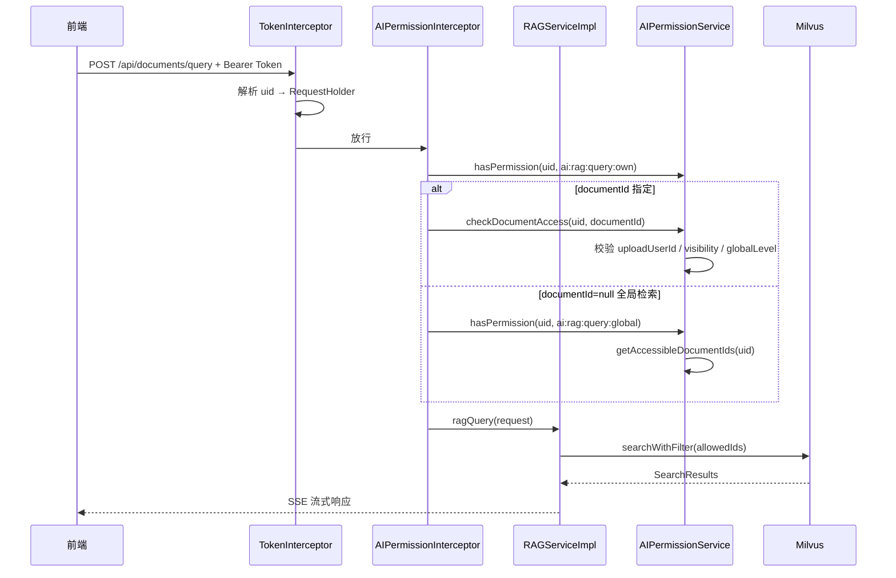

# MallChat 阶梯型权限设计方案

> **文档状态**：聊天域已确认 ✅ | AI 域待确认（确认后方可开始编码）  
> **版本**：v1.1  
> **最后更新**：2026-05-30  
> **关联文档**：[项目笔记-黑名单/权限设计](./项目笔记.md)、[面试准备-群角色权限](./面试准备-MallChat项目.md)、[AI模块架构总览](./AI模块架构总览与优化路线图.md)

---

## 目录

1. [背景与目标](#一背景与目标)
2. [现状盘点](#二现状盘点)
3. [阶梯型权限模型定义](#三阶梯型权限模型定义)
4. [数据模型设计](#四数据模型设计)
5. [后端实现方案](#五后端实现方案)
6. [前端实现方案](#六前端实现方案)
7. [缓存与一致性](#七缓存与一致性)
8. [分阶段实施路线](#八分阶段实施路线)
9. [待确认事项](#九待确认事项)
10. [附录：权限点清单](#十附录权限点清单)

---

## 一、背景与目标

### 1.1 业务背景

MallChat 是 C 端即时通讯产品，权限场景分为两层：

| 层级 | 作用域 | 典型场景 |
|------|--------|----------|
| **全局权限** | 全站 | 撤回他人消息、@所有人、拉黑用户 |
| **群组权限** | 单个群聊 | 踢人、邀请成员、设置管理员 |
| **AI 权限** | 知识库 / 检索 | 文档上传、RAG 检索、跨文档全局搜索、对话历史 |

原设计文档（`项目笔记.md`）指出：C 端不需要 B 端那样复杂的「用户→角色→权限→资源」四层模型，**权限做到角色级别、前后端约定即可**。但随着功能增多，当前「硬编码角色 + 散落判断」已出现前后端不一致问题，需要升级为**阶梯型权限**。

### 1.2 什么是「阶梯型权限」

**阶梯型权限** = 权限按等级递增，**高层级自动包含低层级能力**，且支持**全局域**与**群组域**两套独立阶梯：

```
全局域：普通用户(0) < 群聊管理员(1) < 超级管理员(2)
群组域：普通成员(3) < 群管理员(2) < 群主(1)   ← 数字越小权限越高
```

核心原则：

1. **继承性**：超管拥有群聊管理员全部能力；群主拥有群管理员全部能力
2. **域隔离**：全局权限不自动等同于某群群主（除超管特殊穿透）
3. **最小暴露**：前端只展示用户实际拥有的操作入口，后端必须独立校验

### 1.3 设计目标

| 目标 | 说明 |
|------|------|
| 修复现有缺陷 | 前端 `power` 字段与后端角色语义不一致 |
| 统一校验入口 | 消除散落在各 Service 的 `hasPower` 硬编码 |
| 保持 C 端简洁 | 第一阶段不引入动态权限配置后台 |
| 可演进 | 预留升级到完整 RBAC 的扩展点 |

---

## 二、现状盘点

### 2.1 已有数据库表

```sql
-- role：全局角色（仅 name，无 level/权限关联）
-- user_role：用户与全局角色多对多
-- group_member.role：群成员角色（1群主 2管理 3成员）
```

**缺失**：`permission` 表、`role_permission` 关联表（原设计有意省略）。

### 2.2 已有代码结构

| 组件 | 路径 | 现状 |
|------|------|------|
| 全局角色枚举 | `RoleEnum` | ADMIN(1)、CHAT_MANAGER(2) |
| 群角色枚举 | `GroupRoleEnum` | LEADER(1)、MANAGER(2)、MEMBER(3) |
| 权限判断 | `RoleServiceImpl#hasPower` | 按角色 ID 匹配 + 超管兜底，**非真正权限点校验** |
| 群操作权限 | `RoomAppServiceImpl#hasPower` | 群主/群管/超管可踢人，逻辑内联 |
| 登录返回 | `WSLoginSuccess.power` | **仅 0/1 二值**，CHAT_MANAGER 也被标为 1 |
| 前端判断 | `PowerEnum` + `userInfo.power` | 拉黑/撤回均用 `power===ADMIN`，**与后端不一致** |

### 2.3 已识别的关键问题（必须修复）

#### 问题 1：前后端权限语义错位

| 能力 | 后端要求角色 | 前端判断条件 | 结果 |
|------|-------------|-------------|------|
| 撤回他人消息 | CHAT_MANAGER 或 ADMIN | `power === 1` | CHAT_MANAGER 用户可见撤回，**基本正确** |
| 拉黑用户 | **仅 ADMIN** | `power === 1` | CHAT_MANAGER 用户**错误显示**拉黑按钮 |
| @所有人 | CHAT_MANAGER（全局） | 无前端拦截 | 依赖后端，可接受 |

#### 问题 2：`hasPower` 命名误导

```java
// 实际语义是「是否拥有某角色（或超管）」，不是「是否拥有某权限点」
boolean hasPower(Long uid, RoleEnum roleEnum);
```

#### 问题 3：群权限逻辑分散

踢人规则写在 `RoomAppServiceImpl`，@all 校验在 `TextMsgHandler`，面试文档中的 `GroupPermissionService` **未落地**。

#### 问题 4：双轨 RoleEnum 命名冲突

- 后端 `RoleEnum`：全局角色
- 前端 `RoleEnum`：群成员角色（LORD/ADMIN/NORMAL）

### 2.4 AI 模块现状（检索权限：**未做**）

> 结论：**AI 模块目前只有 Redis 限流，没有真正的权限管控。**  
> `架构设计详解.md` 中「文档权限控制」仅为规划，代码未落地。

| 能力 | 当前实现 | 风险 |
|------|----------|------|
| 身份识别 | `userId` 来自请求体 / `X-User-Id` 请求头，**未校验 Token** | 可伪造任意用户 ID |
| RAG 检索 | `RAGServiceImpl#ragQuery` 直接调 Milvus，**无文档归属校验** | 可检索他人私有文档 |
| 全局检索 | `documentId=null` 时检索**全库所有向量** | 数据泄露 |
| 文档删除 | `deleteDocument` **无 uploadUserId 校验** | 任意用户可删文档 |
| 对话历史 | `getUserSessions(userId)` **无身份绑定** | 可遍历他人会话 |
| 限流 | `RateLimitInterceptor` 按 userId 计数 | 仅有配额控制，非权限控制 |

关键代码证据：

```java
// MilvusVectorService#search — 仅按 documentId 过滤，无用户维度
String expr = documentId != null ? FIELD_DOCUMENT_ID + " == " + documentId : "";

// RateLimitInterceptor — userId 可伪造，未登录直接放行
Long userId = getUserIdFromRequest(request);
if (userId == null) { return true; }
```

`ai_knowledge_document` 表虽有 `upload_user_id` 字段，但**检索链路从未使用**。

---

## 三、阶梯型权限模型定义

### 3.1 全局权限阶梯

```
Level 0 ─ 普通用户 (NORMAL_USER)
    │     能力：发消息、撤回自己的消息（2分钟内）
    ▼
Level 1 ─ 群聊管理员 (CHAT_MANAGER)
    │     继承 L0 + 撤回任意消息、@所有人
    ▼
Level 2 ─ 超级管理员 (ADMIN)
          继承 L1 + 拉黑用户、（预留）敏感词管理、用户封禁
```

### 3.2 群组权限阶梯

```
Level 3 ─ 普通成员 (MEMBER)
    │     能力：发言、@指定成员
    ▼
Level 2 ─ 群管理员 (MANAGER)
    │     继承 L3 + 踢普通成员、（预留）邀请成员
    ▼
Level 1 ─ 群主 (LEADER)
          继承 L2 + 踢群管理员、转让群主、解散群聊（预留）
```

### 3.3 跨域穿透规则（超管特权）

| 场景 | 规则 |
|------|------|
| 踢人 | 全局 ADMIN 可踢任意群成员（**现有逻辑保留**） |
| 撤回消息 | 全局 CHAT_MANAGER/ADMIN 可撤回全站消息 |
| 群设置 | 超管**不自动**成为群主，不介入群内部管理（除非显式加群） |

### 3.4 权限点 vs 角色

采用「**角色阶梯 + 权限点枚举**」混合模型：

- **角色**：标识用户身份层级（存 DB 或 group_member）
- **权限点 (Permission)**：最小操作单元（代码枚举，第一阶段不入库）
- **映射关系**：代码中静态配置 `角色 level ≥ 权限所需 level` 即通过

### 3.5 AI 权限阶梯（新增，复用全局角色等级）

AI 域**不单独造角色**，复用全局阶梯 L0/L1/L2，叠加**文档可见性**控制检索范围：

```
功能阶梯（谁可以用 AI 能力）
─────────────────────────────────────────────────────────
L0 普通用户    ai:assistant:chat        智能助手多轮对话
               ai:rag:query:own         检索「自己上传的私有文档」
               ai:doc:upload:own        上传文档（默认 PRIVATE）

L1 群聊管理员  继承 L0 +
               ai:rag:query:shared      检索「站内共享知识库」文档
               （限流配额提升，见 RateLimitConfig 按 level 差异化）

L2 超级管理员  继承 L1 +
               ai:rag:query:global      跨用户全局检索（documentId=null）
               ai:doc:manage:any        增删改任意文档
               ai:doc:set:visibility    设置文档可见性
```

```
文档可见性（检索能看到哪些文档）— 与功能阶梯正交
─────────────────────────────────────────────────────────
PRIVATE (0)   仅 upload_user_id 本人可检索（默认）
SHARED  (1)   所有已登录且拥有 ai:rag:query:shared 的用户可检索
GLOBAL  (2)   仅拥有 ai:rag:query:global 的用户可检索（超管维护的公共库）
```

**检索权限判定公式**：

```
用户可检索的 documentId 集合 =
  { 自己上传的 PRIVATE 文档 }
  ∪ { visibility=SHARED 的文档 | 用户 level ≥ 1 }
  ∪ { visibility=GLOBAL 的文档 | 用户 level ≥ 2 }
  ∪ { 指定 documentId | checkDocumentAccess(uid, documentId) 通过 }
```

---

## 四、数据模型设计

### 4.1 第一阶段（推荐）：零表变更

不新增数据库表，通过枚举 + 静态映射实现：

```java
// 全局权限点
public enum GlobalPermissionEnum {
    MSG_RECALL_SELF,      // level 0
    MSG_RECALL_ANY,       // level 1
    MSG_AT_ALL,           // level 1
    USER_BLACK,           // level 2
}

// 群组权限点
public enum GroupPermissionEnum {
    MEMBER_AT,            // level 3
    MEMBER_REMOVE,        // level 2（只能踢 level 3）
    MANAGER_REMOVE,       // level 1（只能踢 level 2）
    GROUP_DISMISS,        // level 1（预留）
}
```

### 4.2 第二阶段（可选演进）：完整 RBAC 表

当需要运营后台动态配置角色时，再引入：

```sql
CREATE TABLE `permission` (
  `id`          bigint unsigned NOT NULL AUTO_INCREMENT,
  `code`        varchar(64)  NOT NULL COMMENT '权限编码，如 msg:recall:any',
  `name`        varchar(64)  NOT NULL COMMENT '权限名称',
  `domain`      tinyint      NOT NULL COMMENT '域：1全局 2群组',
  `min_level`   tinyint      NOT NULL COMMENT '最低角色等级',
  PRIMARY KEY (`id`),
  UNIQUE KEY `uk_code` (`code`)
) COMMENT='权限点表';

CREATE TABLE `role_permission` (
  `id`            bigint unsigned NOT NULL AUTO_INCREMENT,
  `role_id`       bigint NOT NULL,
  `permission_id` bigint NOT NULL,
  PRIMARY KEY (`id`),
  KEY `idx_role_id` (`role_id`)
) COMMENT='角色权限关联表';

-- role 表增加 level 字段
ALTER TABLE `role` ADD COLUMN `level` tinyint NOT NULL DEFAULT 0 COMMENT '角色等级，越大权限越高';
```

> **建议**：MallChat 作为 C 端项目，**第一阶段足够**，第二阶段仅在出现运营后台需求时再做。

### 4.3 AI 模块表变更（Phase 1B 需新增 1 列）

```sql
ALTER TABLE `ai_knowledge_document`
  ADD COLUMN `visibility` tinyint NOT NULL DEFAULT 0
  COMMENT '可见性：0=PRIVATE 1=SHARED 2=GLOBAL'
  AFTER `upload_user_id`;

ALTER TABLE `ai_knowledge_document`
  ADD INDEX `idx_visibility` (`visibility`);
```

Milvus 向量 metadata 同步增加 `visibility`、`upload_user_id` 字段，供检索表达式过滤（Phase 2 优化；Phase 1 可 MySQL 预查 + 结果后置过滤）。

---

## 五、后端实现方案

### 5.1 核心类设计

```
common/user/permission/
├── enums/
│   ├── GlobalPermissionEnum.java      # 全局权限点
│   └── GroupPermissionEnum.java       # 群权限点
├── GlobalPermissionService.java       # 全局权限校验
├── GroupPermissionService.java        # 群权限校验（集中踢人/@all 等规则）
└── PermissionAdapter.java             # 登录时组装权限列表返回前端
```

### 5.2 GlobalPermissionService

```java
public interface GlobalPermissionService {
    /** 是否拥有某全局权限点 */
    boolean hasPermission(Long uid, GlobalPermissionEnum permission);

    /** 获取用户全局权限等级 0/1/2 */
    int getGlobalLevel(Long uid);

    /** 获取用户拥有的权限点集合（供登录返回） */
    Set<String> getPermissionCodes(Long uid);
}
```

**等级计算逻辑**：

```java
int getGlobalLevel(Long uid) {
    Set<Long> roles = userCache.getRoleSet(uid);
    if (roles.contains(RoleEnum.ADMIN.getId()))       return 2;
    if (roles.contains(RoleEnum.CHAT_MANAGER.getId())) return 1;
    return 0;
}

boolean hasPermission(Long uid, GlobalPermissionEnum perm) {
    return getGlobalLevel(uid) >= perm.getRequiredLevel();
}
```

### 5.3 GroupPermissionService

```java
public interface GroupPermissionService {
    /** 操作者能否对目标成员执行某群权限 */
    boolean hasPermission(Long groupId, Long operatorUid, Long targetUid,
                          GroupPermissionEnum permission);

    /** 获取用户在群内的角色等级 1/2/3，不在群返回 null */
    Integer getGroupLevel(Long groupId, Long uid);
}
```

**踢人规则矩阵**（与现有逻辑对齐并集中管理）：

| 操作者 \ 被操作者 | 普通成员 | 群管理员 | 群主 |
|------------------|---------|---------|------|
| 普通成员 | ✗ | ✗ | ✗ |
| 群管理员 | ✓ | ✗ | ✗ |
| 群主 | ✓ | ✓ | ✗ |
| 全局超管 | ✓ | ✓ | ✗ |

### 5.4 改造调用点（第一阶段）

| 原调用 | 改造为 |
|--------|--------|
| `iRoleService.hasPower(uid, RoleEnum.ADMIN)` | `globalPermissionService.hasPermission(uid, USER_BLACK)` |
| `iRoleService.hasPower(uid, RoleEnum.CHAT_MANAGER)` | `globalPermissionService.hasPermission(uid, MSG_RECALL_ANY)` |
| `TextMsgHandler` @all 校验 | `globalPermissionService.hasPermission(uid, MSG_AT_ALL)` |
| `RoomAppServiceImpl#hasPower` | `groupPermissionService.hasPermission(...)` |
| `ChatServiceImpl#checkRecall` | 先判 `MSG_RECALL_ANY`，否则走本人 2 分钟逻辑 |

### 5.5 登录响应改造

**现状**：

```java
WSLoginSuccess.power  // Integer, 0 或 1
```

**改造为**（推荐方案 A）：

```java
@Data
public class WSLoginSuccess {
    // ... 原有字段保留
    /** @deprecated 用 permissions 替代，过渡期双写 */
    private Integer power;
    /** 全局权限点编码列表，如 ["msg:recall:any", "user:black"] */
    private List<String> permissions;
    /** 全局权限等级 0/1/2，前端可用于简单判断 */
    private Integer globalLevel;
}
```

**过渡期策略**：`power` 字段保留 3 个月，仅当 `globalLevel >= 1` 时置 1（修复 CHAT_MANAGER 误显示拉黑的问题需配合前端改用 `permissions`）。

### 5.6 注解式鉴权（第二阶段可选）

```java
@Target(ElementType.METHOD)
@Retention(RetentionPolicy.RUNTIME)
public @interface RequireGlobalPermission {
    GlobalPermissionEnum value();
}

// 使用示例
@RequireGlobalPermission(GlobalPermissionEnum.USER_BLACK)
@PutMapping("/black")
public ApiResult<Void> black(@RequestBody BlackReq req) { ... }
```

第一阶段可用 `AssertUtil` + Service 调用，不必上 AOP。

### 5.7 RoleServiceImpl 处理

- **保留** `IRoleService#hasPower` 并标记 `@Deprecated`，内部委托给 `GlobalPermissionService`，避免大范围破坏性改动
- 新代码统一使用 `GlobalPermissionService`

### 5.8 AI 模块实现方案（新增）

#### 5.8.1 统一身份认证 — 接入主服务 Token

AI 模块与 `mallchat-chat-server` 同进程部署，复用现有 `TokenInterceptor` 体系：

```
请求 → TokenInterceptor（解析 JWT → RequestHolder.uid）
     → AIPermissionInterceptor（校验 AI 功能权限 + 注入操作者 uid）
     → RateLimitInterceptor（按 globalLevel 差异化配额）
     → Controller
```

**改造要点**：

- 废弃 `RateLimitInterceptor#getUserIdFromRequest` 从 Header/Param 取 userId 的方式
- 请求体中的 `userId` 仅作兼容，**以 Token 解析的 uid 为准**
- 未登录用户：仅允许访问 health/status；RAG / 助手接口一律 401

#### 5.8.2 新增 AIPermissionService

```java
public interface AIPermissionService {
    /** 是否拥有某 AI 功能权限点 */
    boolean hasPermission(Long uid, AIPermissionEnum permission);

    /** 校验对某文档的访问权，不通过抛 AIException(FORBIDDEN) */
    void checkDocumentAccess(Long uid, Long documentId);

    /** 获取用户可检索的 documentId 集合（全局检索时用） */
    Set<Long> getAccessibleDocumentIds(Long uid);

    /** 校验文档操作权（上传者 / 超管） */
    void checkDocumentManageAccess(Long uid, Long documentId);
}
```

`AIPermissionService` 内部依赖 `GlobalPermissionService#getGlobalLevel(uid)`，不重复维护角色逻辑。

#### 5.8.3 RAG 检索改造（核心）

```java
// RAGServiceImpl#ragQuery 入口增加
Long operatorUid = RequestHolder.get().getUid();
aiPermissionService.checkPermission(operatorUid, AI_RAG_QUERY_OWN); // L0 即可

if (request.getDocumentId() != null) {
    aiPermissionService.checkDocumentAccess(operatorUid, request.getDocumentId());
    searchResults = vectorService.search(queryVector, topK, request.getDocumentId());
} else {
    // 全局检索 — 需要 L2
    aiPermissionService.checkPermission(operatorUid, AI_RAG_QUERY_GLOBAL);
    Set<Long> allowedIds = aiPermissionService.getAccessibleDocumentIds(operatorUid);
    searchResults = vectorService.searchWithFilter(queryVector, topK, allowedIds);
}
```

**Phase 1 降级实现**（不改 Milvus Schema）：

1. MySQL 查出 `allowedIds`
2. 调用现有 `vectorService.search(vector, topK * 3, null)` 扩大召回
3. 后置过滤 `result.documentId ∈ allowedIds`，取 topK

**Phase 2 优化**：Milvus expr `document_id in [1,2,3]` 或 metadata 过滤，避免过度召回。

#### 5.8.4 文档 CRUD 改造

| 接口 | 权限要求 |
|------|----------|
| `POST /upload` | 登录 + `ai:doc:upload:own`（L0）；visibility 默认 PRIVATE |
| `PUT /{id}` | 登录 + 文档 uploadUserId=本人 或 L2 `ai:doc:manage:any` |
| `DELETE /{id}` | 同上 |
| `GET /{id}/status` | 登录 + `checkDocumentAccess` |
| `POST /query` | 登录 + 见 5.8.3 |
| `GET /assistant/history` | 登录 + session 归属 uid 校验 |
| `GET /assistant/sessions` | 登录 + 仅查 Token 中的 uid，**移除 userId 参数** |

#### 5.8.5 限流与权限联动

`RateLimitConfig` 按 `globalLevel` 差异化配额：

| 等级 | RAG 查询/分钟 | 文档上传/天 | 助手问答/分钟 |
|------|-------------|------------|--------------|
| L0 | 10 | 5 | 20 |
| L1 | 30 | 20 | 60 |
| L2 | 100 | 无限制 | 无限制 |

限流是**配额**，权限是**能不能做**；两者叠加，互不替代。

#### 5.8.6 模块目录结构

```
mallchat-ai/mallchat-ai-common/src/main/java/.../permission/
├── enums/AIPermissionEnum.java
├── AIPermissionService.java
└── impl/AIPermissionServiceImpl.java   # 依赖 GlobalPermissionService（chat-server 提供）

mallchat-ai/mallchat-ai-rag/src/main/java/.../interceptor/
├── AIPermissionInterceptor.java        # 新增
└── RateLimitInterceptor.java           # 改造：从 RequestHolder 取 uid
```

> **模块依赖**：`mallchat-ai-common` 引入 chat-server 的 `GlobalPermissionService` 接口（或通过 `mallchat-common` 抽公共 permission 包），避免循环依赖。

---

## 六、前端实现方案

### 6.1 类型定义改造

```typescript
// enums/permission.ts（新建，避免与群 RoleEnum 混淆）
export enum GlobalLevelEnum {
  NORMAL = 0,
  CHAT_MANAGER = 1,
  ADMIN = 2,
}

export const GlobalPermission = {
  MSG_RECALL_SELF: 'msg:recall:self',
  MSG_RECALL_ANY: 'msg:recall:any',
  MSG_AT_ALL: 'msg:at:all',
  USER_BLACK: 'user:black',
} as const

export type GlobalPermissionCode = typeof GlobalPermission[keyof typeof GlobalPermission]
```

### 6.2 UserStore 扩展

```typescript
// stores/user.ts
const hasPermission = (code: GlobalPermissionCode) =>
  userInfo.value?.permissions?.includes(code) ?? false

const isChatManager = computed(() => (userInfo.value?.globalLevel ?? 0) >= 1)
const isSuperAdmin = computed(() => (userInfo.value?.globalLevel ?? 0) >= 2)
```

### 6.3 组件改造对照

| 组件 | 现状 | 改造 |
|------|------|------|
| `ChatList/ContextMenu` 撤回 | `isAdmin \|\| isCurrentUser` | `hasPermission('msg:recall:any') \|\| isCurrentUser` |
| `ChatList/ContextMenu` 拉黑 | `isAdmin`（错误） | `hasPermission('user:black')` |
| `UserList/ContextMenu` 拉黑 | `isAdmin`（错误） | `hasPermission('user:black')` |
| `UserList/ContextMenu` 踢人 | `RoleEnum.LORD/ADMIN` | 保持群角色判断，或抽 `useGroupPermission` |

### 6.4 权限指令（可选）

```typescript
// directives/permission.ts
app.directive('permission', {
  mounted(el, binding) {
    const code = binding.value as GlobalPermissionCode
    if (!useUserStore().hasPermission(code)) {
      el.parentNode?.removeChild(el)
    }
  },
})

// 使用：<ContextMenuItem v-permission="GlobalPermission.USER_BLACK" ... />
```

---

## 七、缓存与一致性

### 7.1 现有缓存

`UserCache#getRoleSet(uid)` 已用 JetCache/`@Cacheable` 缓存用户角色集合。

### 7.2 权限变更失效

| 事件 | 失效策略 |
|------|----------|
| 分配/撤销全局角色 | 清除 `user:roles:{uid}` 缓存 |
| 修改群成员角色 | 清除群成员缓存 `groupMemberCache`（已有） |
| 用户重新登录 | 重新拉取 permissions 列表 |

### 7.3 性能

权限等级由角色集合计算，**O(角色数)**，通常 ≤ 2，无需额外 Redis 结构。

---

## 八、分阶段实施路线

### Phase 1：修复 + 统一（推荐首期，约 2-3 天）

- [ ] 新增 `GlobalPermissionEnum` + `GlobalPermissionService`
- [ ] 新增 `GroupPermissionService`，迁移 `RoomAppServiceImpl` 踢人逻辑
- [ ] 改造 4 个后端调用点（拉黑、撤回、@all、踢人）
- [ ] `WSLoginSuccess` 增加 `permissions` + `globalLevel`
- [ ] 前端修复拉黑按钮误显示问题
- [ ] `IRoleService#hasPower` 标记废弃并委托

**交付标准**：前后端权限判断一致，现有功能无回归。

### Phase 2：体验优化（约 1-2 天）

- [ ] 前端 `v-permission` 指令
- [ ] 抽 `useGroupPermission` composable
- [ ] 补充单元测试（权限矩阵全覆盖）

### Phase 3：完整 RBAC（按需）

- [ ] 新增 permission / role_permission 表
- [ ] 管理后台角色配置页
- [ ] `@RequireGlobalPermission` AOP 切面

### Phase 1B：AI 权限（建议紧跟 Phase 1，约 2 天）

- [ ] `ai_knowledge_document` 增加 `visibility` 字段
- [ ] 新增 `AIPermissionEnum` + `AIPermissionService`
- [ ] 接入 `TokenInterceptor`，废弃伪造 userId
- [ ] 改造 `RAGServiceImpl#ragQuery` 文档访问校验 + 全局检索过滤
- [ ] 改造文档 CRUD、对话历史接口
- [ ] 限流按 globalLevel 差异化
- [ ] 前端 AI 面板按 permissions 控制上传/全局检索入口

**交付标准**：普通用户无法检索他人私有文档；全局检索仅超管可用；未登录无法调用 AI 接口。

### Phase 2B：AI 检索性能优化（按需）

- [ ] Milvus metadata 增加 visibility / upload_user_id
- [ ] `searchWithFilter` 原生 expr 过滤，去掉后置过滤
- [ ] 查询结果缓存 key 加入 uid（防止跨用户缓存命中）

---

## 九、待确认事项

> ⚠️ **聊天域 9.1~9.3 已确认 ✅ | AI 域 9.4 待确认后一并编码**

### 9.1 方案层面（已确认 ✅）

| # | 问题 | 选项 | 建议 |
|---|------|------|------|
| 1 | 第一期是否新增数据库表？ | A. 不新增（枚举方案） / B. 直接上 RBAC 表 | **A** |
| 2 | `WSLoginSuccess.power` 如何处理？ | A. 废弃改 permissions / B. 扩展为 0/1/2 三档 / C. 双写过渡 | **C 双写过渡** |
| 3 | @all 权限归属？ | A. 仅全局 CHAT_MANAGER / B. 群管理员也可 @all | **A**（与现网一致） |
| 4 | 超管是否可踢群主？ | A. 可以 / B. 不可以 | **B**（与现网 `isLord` 拦截一致） |
| 5 | 群聊管理员(CHAT_MANAGER) 能否拉黑？ | A. 能 / B. 不能 | **B**（与现网后端一致，修复前端） |

### 9.2 实施范围

| # | 问题 | 建议 |
|---|------|------|
| 6 | 第一期是否包含前端 `v-permission` 指令？ | 第二期再做，第一期改 ContextMenu 即可 |
| 7 | 是否需要权限管理 REST API（查/改用户角色）？ | 第一期不需要，继续 DB 手动分配 |
| 8 | `GroupPermissionService` 是否覆盖邀请成员权限？ | 第一期仅迁移已有逻辑，邀请暂不校验操作者身份 |

### 9.3 文档层面

| 文档 | 处理建议 |
|------|----------|
| `docs/项目笔记.md` 权限章节 | 文末追加链接指向本文档，标注「已由阶梯型方案替代」 |
| `docs/面试准备-MallChat项目.md` GroupPermissionService | 标注「设计已落地至 GroupPermissionService」 |
| 本文档 | 聊天域已定稿；AI 域待 9.4 确认 |
| `mallchat-ai-rag/docs/架构设计详解.md` 安全设计 | 标注「文档权限控制已落地至 AIPermissionService」 |

### 9.4 AI 域待确认（新增）

| # | 问题 | 选项 | 建议 |
|---|------|------|------|
| 9 | 普通用户能否上传文档？ | A. 能（默认 PRIVATE） / B. 不能 | **A** |
| 10 | 群聊管理员能否做全局检索？ | A. 能 / B. 不能（仅超管） | **B** |
| 11 | SHARED 文档谁可设为 SHARED？ | A. 仅超管 / B. 上传者也可 | **A**（防私有文档被误开放） |
| 12 | 未登录能否使用 AI 助手？ | A. 不能 / B. 限次数试用 | **A** |
| 13 | Phase 1B 是否接受 MySQL 后置过滤？ | A. 接受（先上线） / B. 必须 Milvus 原生过滤 | **A** |
| 14 | AI 权限包放哪？ | A. 抽到 `mallchat-common` / B. AI 模块自建依赖 chat-server | **A**（避免循环依赖） |

---

## 十、附录：权限点清单

### 全局权限点

| 编码 | 名称 | 所需等级 | 后端入口 | 前端入口 |
|------|------|---------|---------|---------|
| `msg:recall:self` | 撤回自己的消息 | 0 | `ChatServiceImpl#checkRecall` | 消息右键-撤回 |
| `msg:recall:any` | 撤回他人消息 | 1 | 同上 | 消息右键-撤回 |
| `msg:at:all` | @所有人 | 1 | `TextMsgHandler#checkMsg` | 输入框 @ |
| `user:black` | 拉黑用户 | 2 | `UserController#black` | 用户/消息右键-拉黑 |

### 群组权限点

| 编码 | 名称 | 所需群等级 | 后端入口 | 前端入口 |
|------|------|-----------|---------|---------|
| `group:member:at` | @群成员 | 3 | 无限制 | @ 选择器 |
| `group:member:remove` | 踢普通成员 | 2 | `RoomAppServiceImpl#delMember` | 成员右键-踢出 |
| `group:manager:remove` | 踢群管理员 | 1 | 同上 | 同上 |
| `group:dismiss` | 解散群聊 | 1 | 未实现 | 未实现 |

### AI 权限点

| 编码 | 名称 | 所需等级 | 后端入口 | 前端入口 |
|------|------|---------|---------|---------|
| `ai:assistant:chat` | 智能助手对话 | 0 | `AIAssistantController#answerQuestion` | AI 助手面板 |
| `ai:rag:query:own` | 检索自有文档 | 0 | `RAGServiceImpl#ragQuery` | 知识库问答 |
| `ai:doc:upload:own` | 上传文档 | 0 | `DocumentController#uploadDocument` | 文档上传 |
| `ai:rag:query:shared` | 检索共享知识库 | 1 | `AIPermissionService#getAccessibleDocumentIds` | 共享库 Tab |
| `ai:rag:query:global` | 全局跨文档检索 | 2 | `RAGServiceImpl#ragQuery(documentId=null)` | 全局搜索 |
| `ai:doc:manage:any` | 管理任意文档 | 2 | `DocumentController#update/delete` | 管理后台 |
| `ai:doc:set:visibility` | 设置文档可见性 | 2 | 文档更新接口 | 可见性下拉 |

---

## 十一、AI 模块权限专项

### 11.1 检索权限流程图



### 11.2 与聊天域权限的统一关系

```
                    GlobalPermissionService（统一入口）
                              │
          ┌───────────────────┼───────────────────┐
          ▼                   ▼                   ▼
   ChatServiceImpl    UserController      AIPermissionService
   (撤回/@all)         (拉黑)              (RAG/文档/助手)
          │                   │                   │
          └───────────────────┴───────────────────┘
                              │
                    同一套 globalLevel 0/1/2
                    同一套 permissions 列表下发前端
```

登录响应扩展（与聊天域 Phase 1 一并改造）：

```java
WSLoginSuccess {
    permissions: [
        "msg:recall:any",
        "ai:rag:query:own",
        "ai:assistant:chat"
    ],
    globalLevel: 1
}
```

### 11.3 现有风险修复优先级

| 优先级 | 风险 | 修复 |
|--------|------|------|
| P0 | 全局检索泄露全库 | `documentId=null` 必须 L2 + allowedIds 过滤 |
| P0 | userId 可伪造 | 接入 TokenInterceptor |
| P1 | 任意删文档 | delete 增加 `checkDocumentManageAccess` |
| P1 | 遍历他人会话 | sessions/history 绑定 Token uid |
| P2 | 缓存跨用户命中 | QueryResultCache key 加 uid |

---

## 变更记录

| 版本 | 日期 | 说明 |
|------|------|------|
| v1.0 | 2026-05-30 | 初稿：整合项目笔记 + 代码现状 + 阶梯模型设计 |
| v1.1 | 2026-05-30 | 新增 AI 模块权限专项；聊天域方案已确认 |
